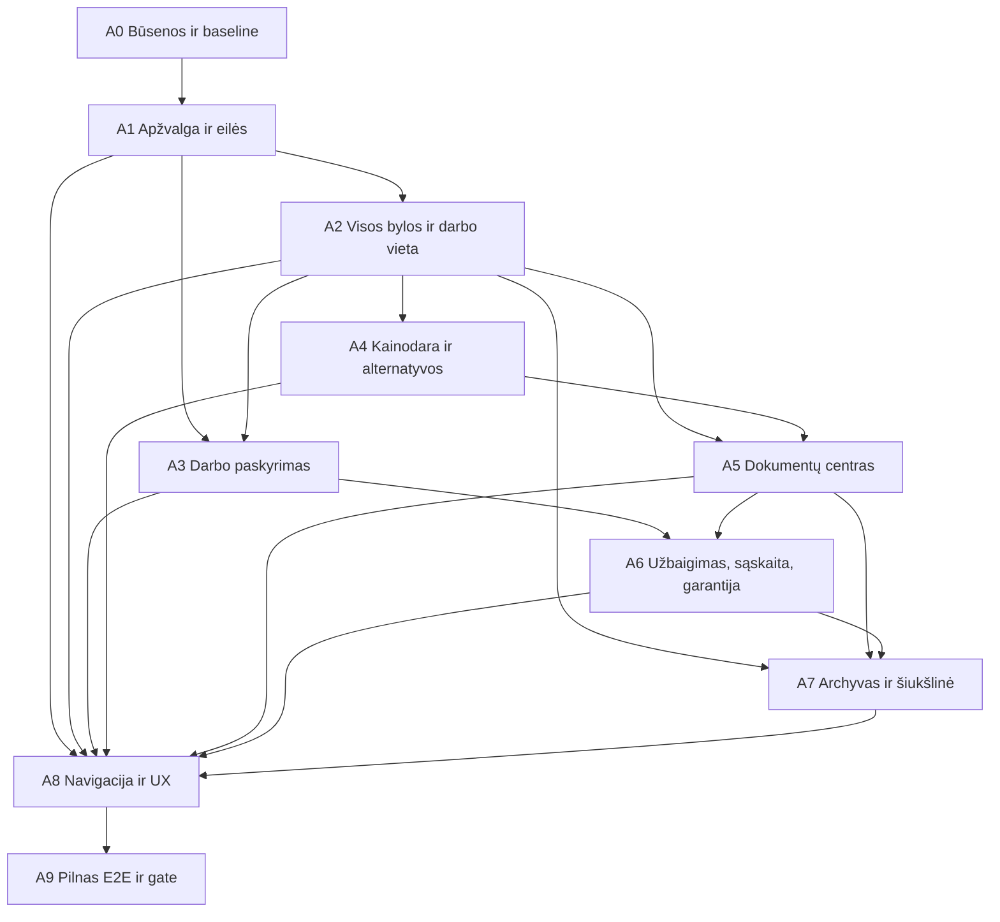

# Takfornyelse – operacinio administravimo užbaigimo planas

**Dokumento paskirtis:** pagrindinis vykdomasis planas, pagal kurį žingsnis po žingsnio užbaigiama `admin-v2` administravimo sistema  
**Parengta:** 2026-08-25  
**Aplinka:** tik izoliuota staging `https://takfornyelse-staging.vercel.app`  
**Produkcinė svetainė:** neliečiama iki paskutinės fazės, pilno patikrinimo ir atskiro savininko patvirtinimo  
**Dabartinė būsena:** R0–R6 techninis pagrindas įgyvendintas; A0–A3 užbaigtos; A4 vykdoma; kasdienis administratoriaus procesas dar neužbaigtas
**Pagrindinė taisyklė:** vienu metu įgyvendinama viena fazė; po kiekvienos fazės privalomi automatiniai testai, rankinis staging patikrinimas ir rezultato įrašymas šiame dokumente

## 1. Galutinis tikslas

Administratorius, prisijungęs prie Takfornyelse valdymo aplinkos, turi be techninio Payload backoffice pagalbos:

1. matyti visas klientų bylas ir tikrą jų būseną;
2. iš karto suprasti, kurioms byloms ir kodėl reikia veiksmo;
3. peržiūrėti bei koreguoti AI parengtą matavimą ir pasiūlymą;
4. keisti stogo plotą, kainą už m², pritaikyti pagrįstą nuolaidą ir pateikti alternatyvų pasiūlymą;
5. patvirtinti pasiūlymą, valdyti kliento klausimus ir abiejų šalių pasirašymą;
6. sukurti darbo užsakymą, priskirti darbuotoją ir suplanuoti darbus;
7. vienoje kliento byloje matyti pasiūlymus, sutartis, darbo dokumentus, sąskaitos būseną ir garantiją;
8. archyvuoti klaidingas, atšauktas ar užbaigtas bylas ir prireikus jas atkurti;
9. techninį backoffice naudoti tik išimtiniais diagnostikos atvejais.

Sistema laikoma užbaigta tik tada, kai staging aplinkoje įrodomas visas procesas nuo naujos užklausos iki užbaigto, dokumentuoto ir archyvuoto užsakymo.

## 2. Nekeičiamos sistemos ribos

- Gemini gali analizuoti, siūlyti ir rašyti juodraščius, tačiau negali savarankiškai patvirtinti kainos, nuolaidos, garantijos, sutarties ar darbų datos.
- Stogo plotas, PVM, kainos ir maksimalios ribos skaičiuojamos deterministinėmis taisyklėmis, o ne laisvu AI tekstu.
- Bet koks administratoriaus kainos pakeitimas turi būti audituojamas: kas, kada, ką ir kodėl pakeitė.
- Nepagrįsti pardavimo teiginiai draudžiami. Negalima rašyti, kad „visi kaimynai renkasi“ ar „visi klientai patenkinti“, jeigu tam nėra patikimų duomenų.
- Pasirašytos sutartys, oficialūs dokumentai ir kiti teisiškai saugotini duomenys negali būti negrįžtamai pašalinti kaip paprasta bandomoji užklausa.
- Vidinis sąskaitos dokumentas negali būti pateikiamas kaip oficiali apskaitos sąskaita, kol nepatvirtinta Norvegijos numeravimo ir apskaitos tvarka arba integracija.
- Viešas turinys ir bendravimas su klientais lieka norvegų bokmål kalba; LT, EN ir NO pasirinkimas taikomas tik administratoriaus ir darbuotojo sąsajai.

## 3. Audito metu nustatyta pradinė padėtis

### 3.1 Kas jau veikia

- klientų užklausos saugomos sistemoje;
- automatinė gavimo el. pašto žinutė veikia;
- adresas, pastato kandidatai, stogo matavimas ir deterministinis kainos pagrindas egzistuoja;
- administratorius gali ranka pakeisti matuojamą stogo plotą;
- pasiūlymo, kliento signatūros ir tiekėjo kontraparašo procesas techniškai sukurtas;
- galutiniai PDF dokumentai ir bendra Takfornyelse vizualinė forma įgyvendinti;
- galima sukurti darbo užsakymą;
- darbuotojo `/user` procesas veikia;
- egzistuoja `admin-v2` apžvalga, bylos puslapis, pagrindinės eilės ir trijų kalbų panelės.

### 3.2 Kritiniai neužbaigti tarpai

| Sritis                   | Dabartinė problema                                                                                       | Reikalingas galutinis rezultatas                                                    |
| ------------------------ | -------------------------------------------------------------------------------------------------------- | ----------------------------------------------------------------------------------- |
| Naujos užklausos         | Automatika greitai pakeičia būseną iš `new`, todėl kortelė gali rodyti 0, nors užklausa dar neperžiūrėta | Skaičiuoti pagal realų administratoriaus veiksmą, ne tik techninę būseną            |
| Pasirašyta sutartis      | Abi pusės pasirašė, tačiau atidėjus darbo sukūrimą byla nėra pakankamai matoma                           | Pagrindinė eilė „Pasirašyta – sukurti/priskirti darbą“                              |
| Nepriskirtas darbas      | `unassigned` neįtraukiamas į aktyvius darbus ir rodomas nepakankamai ryškiai                             | Atskira pagrindinė eilė iki faktinio darbuotojo paskyrimo                           |
| Darbo sukūrimas          | Custom admin veiksmas priima tik sutartį                                                                 | Vienoje formoje kurti darbą, paskirti darbuotoją ir, jei žinoma, datą               |
| Kitos užduoties terminas | Kai kur rodoma ankstesnio veiksmo ar pasirašymo data                                                     | Terminas perskaičiuojamas pagal dabartinį kitą veiksmą                              |
| Kortelių logika          | Dalis kortelių yra būsenų skaitikliai, o ne realios darbų eilės                                          | Kiekviena kortelė atidaro tiksliai tą pačią darbų aibę, kurią suskaičiavo           |
| Kainodara                | Nėra patogaus bylos lygio kainos už m², nuolaidos ir alternatyvos redaktoriaus                           | Audituojamas pasiūlymo komponavimo įrankis su peržiūra                              |
| Papildomas pasiūlymas    | AI neturi saugios struktūros pasiūlyti papildomą paslaugą                                                | AI rekomendacija → administratoriaus patvirtinimas → du aiškūs kliento pasirinkimai |
| Dokumentai               | Kasdienė nuoroda veda į techninių failų collection                                                       | Dokumentų centras pagal klientą, bylą, tipą ir būseną                               |
| Sąskaita ir garantija    | Nėra pilno bylos lygio registro                                                                          | Sąskaitos juodraštis/būsena ir garantijos įrašas su terminu                         |
| Archyvas                 | Nėra aiškaus soft-delete, šiukšlinės ir atkūrimo proceso                                                 | Archyvas, šiukšlinė, atkūrimas ir kontroliuojamas galutinis valymas                 |
| Paieška                  | Paieška neapima visų dokumentų, sąskaitų ir archyvo                                                      | Vieninga paieška per visas kasdienes administravimo esybes                          |
| Techninis backoffice     | Dalis kasdienių nuorodų vis dar veda į Payload                                                           | Normalus darbas atliekamas tik `admin-v2`; techninė nuoroda paslėpta                |

## 4. Tikslinė veiksmų ir būsenų matrica

Administratoriaus eilės turi būti paremtos kitu būtinu veiksmu, o ne vien žaliu duomenų bazės statusu.

| Operacinė eilė                    | Į ją patenka                                                                               | Iš jos išeina, kai                                                                    |
| --------------------------------- | ------------------------------------------------------------------------------------------ | ------------------------------------------------------------------------------------- |
| Naujos / neperžiūrėtos užklausos  | Nauja byla, kurios administratorius dar neatidarė arba nepatvirtino automatinio apdorojimo | Atlikta pirmoji administratoriaus peržiūra arba aiškiai užregistruotas kitas veiksmas |
| Matavimas ir pasiūlymas patikrai  | Yra AI/matavimo/pasiūlymo juodraštis arba reikalingas pastato pasirinkimas                 | Administratorius patvirtina, koreguoja arba pažymi, kad reikia daugiau informacijos   |
| Laukiama kliento                  | Pasiūlymas ar klausimas išsiųstas ir nėra kliento sprendimo                                | Klientas atsako, pasirenka, atmeta, pasirašo arba terminas baigiasi                   |
| Laukia mūsų parašo                | Klientas pasirašė, įmonė dar ne                                                            | Įmonės įgaliotas asmuo pasirašo arba byla teisėtai atšaukiama                         |
| Pasirašyta – sukurti darbą        | Abi pusės pasirašė, darbo užsakymo dar nėra                                                | Darbo užsakymas sukuriamas                                                            |
| Laukia darbuotojo paskyrimo       | Darbo užsakymas sukurtas be darbuotojo                                                     | Aktyvus darbuotojas priskiriamas                                                      |
| Reikia suplanuoti                 | Darbuotojas priskirtas, tačiau nėra datos / atvykimo lango                                 | Data patvirtinama ir klientui išsiunčiamas pranešimas                                 |
| Aktyvūs darbai                    | Suplanuotas, vykstamas arba atliekamas darbas                                              | Darbuotojas užbaigia privalomus veiksmus                                              |
| Užbaigimo patikra                 | Darbuotojas pažymėjo darbą baigtu                                                          | Administratorius patvirtina faktus, kainą ir dokumentaciją                            |
| Dokumentai / sąskaita / garantija | Trūksta bent vieno privalomo galutinio įrašo                                               | Visi privalomi dokumentai parengti ir užsakymas uždarytas                             |
| Reikalauja dėmesio                | Klaida, pradelstas veiksmas, žema confidence, blokavimas ar nesuderinami duomenys          | Problema išsprendžiama ir užregistruojamas rezultatas                                 |
| Archyvas                          | Užbaigta, atšaukta, prarasta arba klaidinga byla                                           | Byla atkuriama arba pagal retention taisykles galutinai sutvarkoma                    |

## 5. Įgyvendinimo fazės

### Fazė A0 – vykdymo kontraktas ir testavimo baseline

**Statusas:** užbaigta 2026-08-25
**Tikslas:** prieš keičiant logiką užfiksuoti vieną nekintamą būsenų žodyną, testinius scenarijus ir dabartinį staging atskaitos tašką.

**Darbai:**

- šį dokumentą paskelbti pagrindiniu likusio `admin-v2` užbaigimo planu;
- suvienodinti techninių statusų, operacinių eilių ir LT/EN/NO pavadinimų lentelę;
- aprašyti visus leidžiamus perėjimus nuo užklausos iki archyvo;
- sukurti anoniminius kontrolinius scenarijus: pilna užklausa, trūkstamas adresas, žema matavimo confidence, kliento klausimas, atmetimas, pasirašymas, nepriskirtas darbas, užbaigimas ir klaidinga užklausa;
- užfiksuoti dabartinį commit, Preview deployment ir rollback procedūrą;
- nurodyti, kurioms vėlesnėms fazėms dar reikės verslo sprendimų.

**Fazės pasiektas rezultatas:** visa komanda ir testai remiasi viena būsenų matrica; nebelieka skirtingų to paties statuso interpretacijų.

**Užbaigimo kriterijai:**

- būsenų matrica patvirtinta ir aprašyta kode naudojamais raktais;
- kiekvienas kontrolinis scenarijus turi pradinę būseną, veiksmą ir laukiamą rezultatą;
- produkcija nepakitusi;
- rollback taškas identifikuotas.

### Fazė A1 – teisingos apžvalgos kortelės ir veiksmų eilės

**Statusas:** užbaigta 2026-08-25  
**Priklausomybė:** A0  
**Tikslas:** administratorius atidaręs apžvalgą iš karto mato viską, kam dabar reikia veiksmo, o kiekvienas skaičius sutampa su atidaromos eilės turiniu.

**Darbai:**

- „Naujos užklausos“ skaičiuoti pagal neperžiūrėtą administratoriaus darbą, o ne tik `status = new`;
- pridėti pagrindines korteles `Pasirašyta – sukurti darbą` ir `Laukia darbuotojo paskyrimo`;
- atskirti `Reikia suplanuoti`, `Aktyvūs darbai` ir `Užbaigimo patikra`;
- išplėsti `Reikalauja dėmesio` žemos confidence, nepavykusių job, pradelstų veiksmų, blokavimo ir dokumentų trūkumo priežastimis;
- kiekvienoje eilutėje rodyti aiškią priežastį ir vieną kitą veiksmą;
- sutvarkyti kitos užduoties terminą, kad nebūtų rodomas ankstesnio etapo laikas;
- įdiegti skaitiklio ir eilės pariteto testą: kortelės skaičius privalo sutapti su eilės įrašų skaičiumi.

**Fazės pasiektas rezultatas:** nė viena veiksmo laukianti byla nepradingsta iš administratoriaus apžvalgos keičiantis techninei būsenai.

**Užbaigimo kriterijai:**

- visos apžvalgos kortelės yra paspaudžiamos ir atidaro teisingai filtruotą sąrašą;
- pasirašyta sutartis be darbo matoma pagrindinėje eilėje;
- sukurtas, bet nepriskirtas darbas išlieka pagrindinėje eilėje;
- kiekvienos kortelės skaičius sutampa su jos eilės turiniu;
- LT, EN ir NO tekstai patikrinti;
- staging atliktas rankinis testas su bent trimis skirtingomis bylomis.

### Fazė A2 – „Visos bylos“, paieška ir aiški bylos darbo vieta

**Statusas:** užbaigta 2026-08-25  
**Priklausomybė:** A1  
**Tikslas:** administratorius gali rasti bet kurią bylą nepriklausomai nuo jos būsenos ir valdyti ją vienoje aiškioje darbo vietoje.

**Darbai:**

- sukurti `Visos bylos` sąrašą su filtrais pagal būseną, kitą veiksmą, darbuotoją, datą ir dėmesio priežastį;
- išplėsti paiešką vardu, telefonu, el. paštu, adresu, bylos, pasiūlymo, sutarties, darbo ir dokumento numeriu;
- bylos viršuje visada rodyti būseną, atsakingą asmenį, kitą veiksmą ir terminą;
- sugrupuoti klientą, matavimą, komerciją, komunikaciją, darbą, dokumentus ir laiko juostą;
- padaryti laiko juostos įvykius paspaudžiamus ir atverti visą susijusią informaciją;
- normalioje sąsajoje paslėpti techninius ID bei Payload terminus;
- palikti suskleistą `Išplėstinė techninė peržiūra` tik techniniam administratoriui.

**Fazės pasiektas rezultatas:** bet kurią bylą galima surasti, suprasti ir tęsti neatidarant techninio backoffice.

**Užbaigimo kriterijai:**

- paieška grąžina kontrolines bylas pagal visus numatytus laukus;
- kiekvienas laiko juostos įvykis atveria atitinkamą žinutę, dokumentą arba būsenos pakeitimą;
- administratoriaus kasdienio scenarijaus metu nereikia Payload collection puslapių;
- veikia desktop ir mobilioje administratoriaus sąsajoje;
- prieigos testai neleidžia darbuotojui ar anonimui matyti admin duomenų.

### Fazė A3 – darbo sukūrimas, paskyrimas ir planavimas vienoje vietoje

**Statusas:** užbaigta 2026-08-25
**Priklausomybė:** A1, A2  
**Tikslas:** po galutinės sutarties administratorius vienu aiškiu procesu sukuria darbą, paskiria darbuotoją ir, jei įmanoma, suplanuoja datą.

**Darbai:**

- išplėsti custom admin veiksmą, kad priimtų sutartį, darbuotoją, planuojamą datą, atvykimo langą ir pastabą;
- leisti saugiai sukurti darbą be darbuotojo, tačiau automatiškai palikti jį `Laukia darbuotojo paskyrimo` eilėje;
- bylos puslapyje pridėti darbuotojo paskyrimo ir datos keitimo formą;
- rodyti tik aktyvius darbuotojus ir neleisti paskirti netinkamos paskyros;
- užtikrinti idempotenciją – pakartotinis paspaudimas nesukuria antro darbo;
- po paskyrimo perkelti bylą į `Reikia suplanuoti` arba `Aktyvūs darbai`;
- persiųsti darbuotojui užduotį ir klientui datą tik pagal patvirtintą komunikacijos taisyklę.

**Fazės pasiektas rezultatas:** sutartis niekada nelieka be aiškaus kito žingsnio, o darbo paskyrimas atliekamas ne techninėje sistemoje.

**Užbaigimo kriterijai:**

- abi šalys pasirašo → sukuriamas vienas darbo užsakymas;
- galima iš karto priskirti darbuotoją ir datą;
- atidėjus paskyrimą byla išlieka matomoje eilėje;
- paskyrus darbuotoją darbas matomas jo `/user` paskyroje;
- pakartotiniai veiksmai nesukuria duplikatų;
- patikrinti perskyrimo, datos keitimo ir atšaukimo scenarijai.

### Fazė A4 – pasiūlymo redaktorius, kainos kontrolė ir alternatyvos

**Statusas:** suplanuota  
**Priklausomybė:** A2  
**Tikslas:** administratorius patogiai, audituojamai ir saugiai parengia galutinį komercinį pasiūlymą, įskaitant pagrįstą papildomos paslaugos variantą.

**Darbai:**

- viename pasiūlymo redaktoriuje rodyti patvirtintą stogo plotą, bazinę kainos taisyklę, kainą už m², PVM ir bendrą sumą;
- leisti ranka pakeisti stogo plotą, vieneto kainą, fiksuotą arba procentinę nuolaidą;
- kiekvienam pakeitimui reikalauti priežasties ir išsaugoti administratorių, laiką, seną bei naują reikšmę;
- įvesti verslo patvirtintą minimalią kainos / maržos ribą arba papildomą patvirtinimą nukrypus nuo jos;
- Gemini leisti tik pasiūlyti papildomą paslaugą ir paaiškinimą; pritaikymas galimas tik administratoriui patvirtinus;
- klientui vienoje saugioje nuorodoje pateikti originalų ir rekomenduojamą variantą su aiškiu kainų skirtumu;
- tik kliento pasirinktas variantas tampa sutarties komerciniu snapshot;
- generuoti naują pasiūlymo versiją, o ankstesnę išsaugoti istorijoje;
- prieš siuntimą rodyti tikslų HTML, PDF ir el. laiško preview.

**Profesionalios rekomendacijos principas:**

> „Vi anbefaler impregnering etter vask når takets tilstand er egnet, fordi behandlingen kan redusere fuktopptak og forlenge effekten av rengjøringen. Tillegg: X kr inkl./eks. mva. som tydelig angitt.“

Tekstas bus pritaikytas patvirtintoms paslaugų taisyklėms. Jis negalės teigti, kad paslauga būtina ar populiari, jeigu sistema neturi faktinio pagrindo.

**Fazės pasiektas rezultatas:** administratorius gali pasiūlyti sąžiningą bazinį ir geresnės apimties variantą, aiškiai kontroliuodamas kainą ir jos istoriją.

**Užbaigimo kriterijai:**

- rankinis plotas perskaičiuoja visas sumas deterministiškai;
- vieneto kainos ir nuolaidos pakeitimai yra audituojami;
- neleistina kainos riba blokuojama arba reikalauja papildomo patvirtinimo;
- klientas gali pasirinkti tik vieną variantą;
- sutartis naudoja tik pasirinktą pasiūlymo versiją;
- HTML, PDF, PVM ir el. laiško sumos sutampa;
- patikrinti pakeitimo, atmetimo ir pasibaigusios nuorodos scenarijai.

### Fazė A5 – klientų bylomis paremtas dokumentų centras

**Statusas:** suplanuota  
**Priklausomybė:** A2, A4  
**Tikslas:** visi klientui ir užsakymui svarbūs dokumentai randami vienoje vietoje, o administratorius nemato neaiškaus techninių failų sąrašo.

**Darbai:**

- sukurti custom `/admin-v2/documents` puslapį;
- dokumentus grupuoti pagal klientą ir bylą;
- įvesti dokumento tipus: užklausos patvirtinimas, matavimo ataskaita, pasiūlymo versija, kliento pasirašyta sutartis, galutinė sutartis, pakeitimo susitarimas, darbo dokumentacija, sąskaitos juodraštis, garantija;
- rodyti dokumento būseną, versiją, sukūrimo datą, siuntimą ir susijusią bylą;
- leisti peržiūrėti ir atsisiųsti dokumentą iš bylos bei bendro registro;
- atskirti nuolatinius dokumentus nuo laikinų techninių medijų;
- išlaikyti signuotų dokumentų hash ir nekintamumo įrodymą;
- paieškoje įtraukti dokumento numerį, tipą ir klientą.

**Fazės pasiektas rezultatas:** atidarius kliento bylą aiškiai matoma visa dokumentų grandinė nuo užklausos iki galutinio užbaigimo.

**Užbaigimo kriterijai:**

- kiekvienas kontrolinės bylos dokumentas matomas tinkamoje kategorijoje;
- pasiūlymo ir sutarties versijos nesusimaišo;
- dokumento preview ir atsisiuntimas veikia pagal teises;
- signuotas dokumentas negali būti perrašytas;
- kasdienis dokumentų darbas nereikalauja Payload `private-media` collection.

### Fazė A6 – užbaigimo patikra, sąskaitos juodraštis ir garantijos registras

**Statusas:** suplanuota  
**Priklausomybė:** A3, A5  
**Tikslas:** po darbuotojo atlikto darbo administratorius turi aiškią galutinę kontrolę ir nepalieka bylos be komercinių bei garantinių dokumentų.

**Darbai:**

- sukurti `Užbaigimo patikra` veiksmą su prieš/po nuotraukomis, faktiniu plotu, galutine suma, atliktų paslaugų sąrašu ir pastabomis;
- neleisti uždaryti darbo, jei trūksta privalomų duomenų arba yra nepatvirtintas pakeitimas;
- sukurti sąskaitos juodraščio įrašą su suma, PVM, terminu, būsena ir išorinės apskaitos nuoroda;
- įvesti būsenas `juodraštis`, `patvirtinta`, `eksportuota`, `išsiųsta`, `apmokėta`, `vėluoja`, `anuliuota`;
- sukurti garantijos įrašą su aprėptimi, pradžia, pabaiga, sąlygų versija ir PDF;
- viską susieti su dokumentų centru ir bylos laiko juosta;
- neleisti sistemai apsimesti oficialia apskaitos sistema, kol nepatvirtintas apskaitos procesas.

**Fazės pasiektas rezultatas:** užbaigtas darbas turi aiškią faktų patikrą, dokumentus, sąskaitos būseną ir garantijos terminą.

**Užbaigimo kriterijai:**

- byla neuždaroma be privalomos dokumentacijos;
- galutinė suma sutampa su patvirtintu pasiūlymu arba patvirtintu pakeitimo susitarimu;
- sąskaitos juodraštis turi savininką ir kitą veiksmą;
- garantija rodoma bylos dokumentuose ir turi galiojimo pabaigą;
- patikrintas bent vienas pilnas užbaigimo scenarijus.

**Prieš produkcinį aktyvavimą būtinas verslo sprendimas:** pasirinkta apskaitos sistema, numeravimo taisyklė, siuntimo procesas ir patvirtintos garantijos sąlygos.

### Fazė A7 – archyvas, šiukšlinė, atkūrimas ir retention

**Statusas:** suplanuota  
**Priklausomybė:** A2, A5, A6  
**Tikslas:** klaidingos ir nebeaktyvios bylos netrukdo kasdieniam darbui, tačiau duomenys tvarkomi saugiai, audituojamai ir pagal teisinius saugojimo reikalavimus.

**Darbai:**

- įvesti `archivedAt`, `archivedBy`, archyvavimo priežastį ir klasifikaciją;
- įvesti šiukšlinės būseną, pašalinimo datą ir galimą `purgeAfter`;
- pridėti veiksmus `Archyvuoti`, `Perkelti į šiukšlinę`, `Atkurti`;
- archyvuotas ir šiukšlinėje esančias bylas pašalinti iš aktyvių kortelių bei paieškos numatyto vaizdo;
- išsaugoti atskirus filtrus atšauktoms, prarastoms, klaidingoms, spam ir užbaigtoms byloms;
- galutiniam ištrynimui naudoti dviejų žingsnių patvirtinimą ir bylos numerio įvedimą;
- pasirašytas sutartis, sąskaitas, auditą ir privalomą darbo dokumentaciją saugoti pagal retention taisykles, prireikus minimizuojant asmens duomenis;
- registruoti visus archyvavimo, atkūrimo ir valymo veiksmus audite.

**Fazės pasiektas rezultatas:** administratorius gali pašalinti triukšmą iš aktyvaus darbo neprarasdamas teisėtai saugotinų įrodymų.

**Užbaigimo kriterijai:**

- klaidingą užklausą galima archyvuoti, perkelti į šiukšlinę ir atkurti;
- ji nebeskaičiuojama aktyviose apžvalgos kortelėse;
- pasirašytos bylos negalima galutinai pašalinti kaip paprasto lead;
- susiję dokumentai nepaliekami be bylos ir nepašalinami klaidingai;
- retention ir prieigos testai praeina.

### Fazė A8 – navigacijos ir techninio fallback sutvarkymas

**Statusas:** suplanuota  
**Priklausomybė:** A1–A7  
**Tikslas:** visa kasdienė administratoriaus kelionė vyksta aiškioje Takfornyelse aplinkoje, o techninis backoffice lieka tik diagnostikai.

**Tikslinė navigacija:**

```text
Apžvalga
Visos bylos
Pasiūlymai
Sutartys
Darbai
  - Laukia paskyrimo
  - Reikia suplanuoti
  - Aktyvūs
  - Užbaigimo patikra
  - Užbaigti
Dokumentai
Archyvas ir šiukšlinė
Blogas
Darbuotojai
Nustatymai
```

**Darbai:**

- pakeisti technines dokumentų, darbuotojų ir nustatymų nuorodas custom admin puslapiais;
- suvienodinti kortelių, lentelių, filtrų, būsenų ženklelių ir veiksmų dizainą;
- sutvarkyti tuščias būsenas, klaidų tekstus, patvirtinimo dialogus ir mobilią navigaciją;
- kiekviename sąraše rodyti tik reikalingus veiksmus;
- techninį backoffice rodyti tik techniniam administratoriui suskleistoje skiltyje;
- užtikrinti visų administravimo tekstų LT, EN ir NO lokalizaciją.

**Fazės pasiektas rezultatas:** administratorius gali atlikti įprastą darbo dieną nepalikdamas `admin-v2` sąsajos.

**Užbaigimo kriterijai:**

- nė viena pagrindinės navigacijos nuoroda kasdieniam veiksmui neveda į Payload;
- visi tušti, klaidos ir laukimo vaizdai yra suprantami;
- mobilus ir desktop vaizdas vizualiai patikrinti;
- klaviatūros, fokusavimo ir kontrasto patikra atlikta;
- techninis backoffice lieka pasiekiamas tik tinkamai rolei.

### Fazė A9 – pilnas E2E, staging priėmimas ir produkcinė gate

**Statusas:** suplanuota  
**Priklausomybė:** A0–A8  
**Tikslas:** įrodyti, kad visa sistema veikia kaip viena patogi ir saugi administravimo kelionė, prieš bet kokį produkcinį pakeitimą.

**Privalomas pilnas scenarijus:**

1. klientas pateikia užklausą viešoje svetainėje;
2. gauna vieną profiliuotą gavimo patvirtinimą;
3. Gemini ir taisyklių variklis paruošia matavimą bei pasiūlymo juodraštį;
4. administratorius peržiūri ir prireikus pakeičia plotą;
5. administratorius pakeičia kainą arba pritaiko kontrolinę nuolaidą;
6. administratorius patvirtina bazinį ir rekomenduojamą pasiūlymo variantą;
7. klientas pasirenka, užduoda klausimą arba atmeta;
8. pasirinkęs klientas pasirašo sutartį;
9. administratorius kontrapasirašo;
10. administratorius sukuria darbą, paskiria darbuotoją ir datą;
11. darbuotojas atlieka visą `/user` kelionę;
12. administratorius atlieka užbaigimo patikrą;
13. parengiami dokumentai, sąskaitos juodraštis ir garantija;
14. byla uždaroma ir archyvuojama;
15. kontrolinė klaidinga byla perkeliama į šiukšlinę ir atkuriama.

**Testavimo sluoksniai:**

- domeno ir būsenų perėjimo testai;
- API, rolių ir neigiamų prieigos scenarijų testai;
- idempotencijos, retry ir lygiagretaus paspaudimo testai;
- skaitiklių ir eilių pariteto testai;
- dokumentų versijų ir nekintamumo testai;
- kainos, PVM, nuolaidos ir variantų sutapimo testai;
- migracijų ir rollback testai;
- Playwright E2E desktop ir mobiliam vaizdui;
- tikras el. pašto pristatymo patikrinimas;
- lint, typecheck, vienetiniai testai ir production build;
- rankinis savininko priėmimo sąrašas staging aplinkoje.

**Fazės pasiektas rezultatas:** turime dokumentuotą įrodymą, kad nuo užklausos iki archyvo nėra pradingstančių bylų, klaidinančių kortelių, neaiškių veiksmų ar techninio backoffice priklausomybės.

**Užbaigimo kriterijai:**

- visas aukščiau aprašytas E2E praeina be rankinio duomenų taisymo Payload aplinkoje;
- nėra kritinių arba aukšto prioriteto defektų;
- automatiniai testai ir build praeina;
- staging priėmimą atlieka savininkas;
- padarytas naujas produkcijos backup ir patikrintas rollback;
- tik po atskiro savininko patvirtinimo parengiamas produkcinis diegimas.

## 6. Fazės vykdymo protokolas

Kiekviena fazė vykdoma ta pačia tvarka:

1. **Pradžia:** patikrinamas ankstesnės fazės gate ir darbo medžio švara.
2. **Schema ir kontraktai:** pirmiausia aprašomi duomenų, būsenų, API ir migracijų pakeitimai.
3. **Testai:** parašomi arba atnaujinami svarbiausi domeno ir regresijos testai.
4. **Implementacija:** atliekamas tik tos fazės apibrėžtas darbas.
5. **Automatinis tikrinimas:** lint, typecheck, testai, build ir migracijos.
6. **Staging:** sukuriamas Preview deployment ir atliekamas fazės rankinis scenarijus.
7. **Įrodymas:** į dokumentą įrašomas commit, deployment, testų rezultatai, ekrano / E2E įrodymai ir žinomi nukrypimai.
8. **Gate:** fazė pažymima `užbaigta` tik tada, kai įvykdyti visi jos kriterijai.
9. **Perėjimas:** tik uždarius gate pradedama kita fazė.

Jeigu fazės metu randamas kritinis ankstesnio etapo defektas, fazė nestumiama toliau. Defektas ištaisomas, pakartojami susiję ankstesni testai ir tik tada tęsiamas darbas.

## 7. Priklausomybių schema



## 8. Sprendimai, kurių reikės prieš atitinkamas fazes

Šie sprendimai nestabdo A0–A3, tačiau turi būti patvirtinti prieš susijusios fazės produkcinį uždarymą:

| Sprendimas                                                | Reikalingas iki | Saugus laikinas staging variantas                                                          |
| --------------------------------------------------------- | --------------- | ------------------------------------------------------------------------------------------ |
| Minimali leidžiama kaina / marža ir kas gali ją viršyti   | A4              | Kiekvienas nukrypimas reikalauja administratoriaus priežasties; produkcijoje neaktyvuojama |
| Patvirtinti paslaugų paketai ir kada siūlyti impregnavimą | A4              | AI rodo tik vidinę rekomendaciją, kurios administratorius neprivalo naudoti                |
| Apskaitos sistema ir sąskaitų numeravimas                 | A6              | Tik sąskaitos juodraštis ir būsena, ne oficiali sąskaita                                   |
| Garantijų apimtis ir terminai pagal paslaugą              | A6              | Garantijos įrašas be automatinio klientui siunčiamo teisinio pažado                        |
| Konkretūs teisiniai saugojimo terminai                    | A7              | Nieko su pasirašytu / apskaitos pagrindu galutinai netrinti                                |

## 9. Statuso registras

Ši lentelė atnaujinama po kiekvienos fazės. `Užbaigta` reiškia, kad pasiektas ne tik techninis kodas, bet ir patikrintas fazės rezultatas staging aplinkoje.

| Fazė | Statusas                                                         | Commit                                                         | Staging įrodymas                                                                           | Gate pastaba                                                                                       |
| ---- | ---------------------------------------------------------------- | -------------------------------------------------------------- | ------------------------------------------------------------------------------------------ | -------------------------------------------------------------------------------------------------- |
| A0   | Užbaigta                                                         | Pradinis rollback `83f24f8`; fazės dokumentai darbinėje šakoje | 117/117 testų failų ir 349/349 testų; lint ir typecheck praėjo; veikiantis Vercel baseline | Vietinio Windows ARM64 build page-data išimtis dokumentuota                                        |
| A1   | Vykdoma – liko galutinis autentifikuotas staging perėjimų testas | `d228311`                                                      | Vercel `dpl_4xAL4JWzuUugY5rQgyx2ecxnvRou`; 117/117 testų failų ir 364/364 testai           | Naujos kortelės ir pasirašytų sutarčių eilė patikrintos; sesija pasibaigė prieš likusius perėjimus |
| A2   | Suplanuota                                                       | –                                                              | –                                                                                          | –                                                                                                  |
| A3   | Suplanuota                                                       | –                                                              | –                                                                                          | –                                                                                                  |
| A4   | Suplanuota                                                       | –                                                              | –                                                                                          | –                                                                                                  |
| A5   | Suplanuota                                                       | –                                                              | –                                                                                          | –                                                                                                  |
| A6   | Suplanuota                                                       | –                                                              | –                                                                                          | –                                                                                                  |
| A7   | Suplanuota                                                       | –                                                              | –                                                                                          | –                                                                                                  |
| A8   | Suplanuota                                                       | –                                                              | –                                                                                          | –                                                                                                  |
| A9   | Suplanuota                                                       | –                                                              | –                                                                                          | –                                                                                                  |

## 10. Darbų pradžios tvarka

Patvirtinus šį dokumentą darbai pradedami nuo **A0**, iš karto po jo – **A1**, nes pirmasis praktinis prioritetas yra panaikinti pradingstančias bylas ir neteisingas apžvalgos korteles. Produkcinė svetainė per A0–A9 kūrimą lieka nepakeista.
