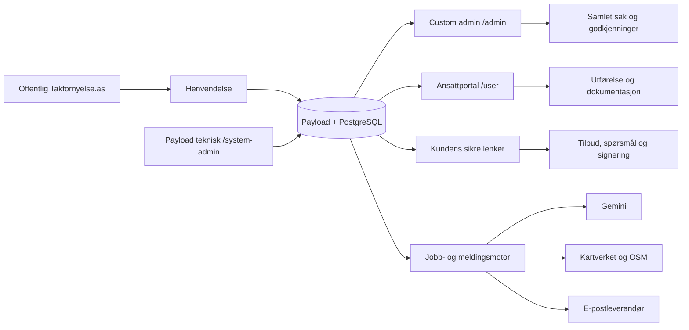
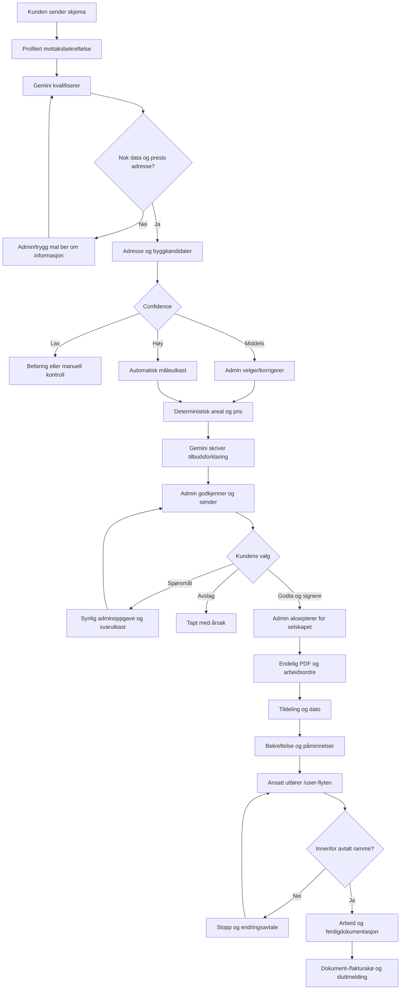

# Takfornyelse.as – gjennomføringsplan for operativ admin og automatisert kundereise

**Status:** Godkjent planleggingsgrunnlag – klar for implementering  
**Revisjon:** 24. august 2026  
**Arbeidsmiljø:** Isolert staging på `takfornyelse-staging.vercel.app`  
**Produksjon:** Skal ikke endres før siste gate og eksplisitt eiergodkjenning  
**Styrende regel:** Én vertikal fase om gangen; kode, brukerflate, test og dokumentasjon godkjennes samlet

**Gjennomføringsstatus:** R0, R1 og R2 er fullført i isolert staging. R3 er teknisk fullført og ekte profilert e-post er verifisert; webhook-leveringskvittering er fortsatt en ekstern gate. R4 og den sentrale `Godkjenn og send`-delen av R5 er teknisk implementert og venter på autentisert staging-E2E. Produksjon er fortsatt urørt.

## 1. Formål

Denne planen styrer den resterende implementeringen etter at det tekniske fundamentet for blogg, henvendelser, måling, pris, tilbud, kontrakt, arbeidsordre og ansattportal er bygget og prøvd i staging.

Målet er ikke flere tekniske collections. Målet er en ferdig operativ løsning der:

- administrator arbeider i en enkel, moderne Takfornyelse-flate på `/admin`;
- ansatt arbeider i den eksisterende mobilflaten på `/user`;
- Payload fortsatt er teknisk backoffice, men ikke nødvendig i daglig drift;
- Gemini forbereder kvalifisering, forklaring og tekst;
- deterministiske regler beregner areal, pris, mva., toleranse og makspris;
- administrator godkjenner alle handlinger med økonomisk, juridisk eller offentlig effekt;
- kunden mottar profesjonelle norske meldinger og dokumenter med Takfornyelse-profil;
- hele reisen fra skjema til ferdigstilt oppdrag er synlig i én sak.

## 2. Korrigert status etter stagingtesten

De tidligere fasene 0–11 beviser et betydelig teknisk fundament. De beviser ikke at den daglige arbeidsflyten er ferdig. Følgende status skal brukes videre:

| Område | Teknisk grunnlag | Operativt gap som lukkes i denne planen |
|---|---|---|
| Blogg | AI-utkast, preview og publisering virker | Flyttes inn i enkel custom admin og får tydelig redaksjonell kø |
| Henvendelse | Skjema, lagring, meldinger og AI-jobb finnes | Profilert mottaksbekreftelse, rask behandling og samlet saksvisning mangler |
| Takmåling | Kartverket, OSM-kandidater, geometri og prisregler finnes | Måling må startes manuelt; automatisk forslag og confidence-ruting mangler |
| Tilbud | Versjon, PDF, kundelenke og utsending finnes | Administrator må navigere mellom flere collections og handlinger |
| Kundespørsmål | Kunden kan sende spørsmål | Tydelig varsling, AI-svarutkast og rask adminoppfølging mangler |
| Kontrakt | Kunden kan signere og PDF låses | Egen selskapsaksept/motsignering og endelig tosidig dokument mangler |
| Arbeidsordre | Tildeling og `/user`-flyt virker | Må samles med administrativ planlegging, varsler og dokumentstatus |
| Meldinger | Outbox, retry og idempotens finnes | Daglig cron gir ikke nødvendig umiddelbarhet eller påminnelsespresisjon |
| Ferdigstilling | Ansatt kan fullføre og sende dokumentasjon | Dokument-/fakturakø og tydelig sluttkontroll i admin mangler |
| Admin | Payload viser alle data | For komplisert til daglig drift; custom operativ portal mangler |
| E-post | Loggdriver virker i staging | Ekte testlevering, branding, reply-håndtering og leveringskontroll mangler |

## 3. Målarkitektur



### 3.1 Én applikasjon og én database

- Custom admin, `/user`, kundesider og offentlig nettsted bygges i samme Next.js-applikasjon.
- Alle bruker samme Payload/PostgreSQL-database, auditlogg og dokumentlager.
- Det opprettes ikke separat CRM, ekstra synkronisering eller ny innlogging.
- Vercel er hosting og drift, ikke administrasjonsgrensesnitt.

### 3.2 Ruteovergang uten driftsstans

| Periode | Operativ admin | Teknisk Payload-admin | Ansatt |
|---|---|---|---|
| Utvikling i staging | `/admin-v2` | eksisterende `/admin` | `/user` |
| Etter godkjent cutover | `/admin` | `/system-admin` | `/user` |

Payload-admin beholdes som teknisk sikkerhetsnett og begrenses til tekniske administratorer. Produksjonsruter endres først etter komplett E2E, backup og eksplisitt godkjenning.

## 4. Operativ admin

### 4.1 Meny

```text
Oversikt
Henvendelser
Tilbud
Kontrakter
Arbeid
Dokumenter og faktura
Kundemeldinger
Blogg
Ansatte
Innstillinger
```

Menyen grupperer samme data etter arbeidsoppgave. Den skal ikke eksponere tekniske collections, interne ID-er eller Payload-begreper i normal bruk.

### 4.2 Oversikt

Oversikten prioriterer handling fremfor statistikk:

- nye henvendelser;
- AI-/måleutkast som venter på kontroll;
- saker som mangler adresse, e-post, bilder eller andre fakta;
- kundespørsmål;
- tilbud som venter på godkjenning eller kundesvar;
- signerte kontrakter uten selskapsaksept, dato eller ansatt;
- dagens og kommende oppdrag;
- blokkerte førkontroller og endringsavtaler;
- dokumenter/faktura som må opprettes eller følges opp;
- mislykkede e-poster, jobber eller integrasjoner;
- blogginnlegg som venter på redaksjonell kontroll.

Hvert kort skal åpne riktig sak og vise én primær neste handling.

### 4.3 Én samlet sak

Administrator skal ikke lete i separate collections. En sak viser samlet:

1. kunde, kontaktkanal, adresse, samtykke og kampanjekilde;
2. kundens tekst og bilder;
3. Gemini-oppsummering, mangler og risikoflagg;
4. adresseoppslag, byggkandidater, polygon, vinkel, confidence og målekilde;
5. låst prisregel og forklarbar beregning;
6. tilbudsversjoner, PDF og utsendingsstatus;
7. kundespørsmål og full kommunikasjonstidslinje;
8. kontrakt, kundeunderskrift, selskapsaksept og dokumenthash;
9. tildelt ansatt, dato, arbeidsstatus og før-/etterbilder;
10. endringsavtaler, ferdigdokumentasjon og faktura-/dokumentstatus;
11. revisjonshistorikk med hvem, hva og når.

Primærknappen følger status, for eksempel `Kontroller AI-utkast`, `Velg riktig bygg`, `Godkjenn og send tilbud`, `Aksepter kontrakt`, `Tildel ansatt` eller `Opprett fakturautkast`.

### 4.4 Språk

- Admin og `/user` kan vises på norsk, litauisk eller engelsk.
- Brukerens panelspråk lagres som preferanse.
- Kundeinnhold, blogg, tilbud, kontrakter, PDF-er og kundemeldinger forblir norsk bokmål.
- Oversettelse av paneltekst skal aldri oversette lagrede kundedokumenter eller forretningsdata.

## 5. Endelig kundereise



### 5.1 Kontaktkrav

- E-post kreves for den helautomatiske tilbuds-, dokument- og signeringsreisen.
- Telefon kan fortsatt registreres og brukes som tillegg.
- Telefon-only henvendelse skal lagres, men merkes `manuell kontakt nødvendig` så lenge SMS ikke er aktivert.
- Kunden skal aldri tro at et tilbud kommer automatisk på e-post hvis e-post ikke er oppgitt.

### 5.2 Arbeidsdeling mellom AI, regler og mennesker

| Aktør | Kan gjøre | Kan ikke gjøre alene |
|---|---|---|
| Gemini | Oppsummere, klassifisere, finne mangler, formulere norsk tekst, forklare låste tall | Bestemme pris, mva., rabatt, dato, garanti, juridisk godkjenning eller HMS |
| Regelmotor | Beregne geometri, helningsfaktor, areal, pris, mva., toleranse og maks | Velge usikkert bygg eller godkjenne kundeavtale |
| Administrator | Korrigere input, godkjenne økonomiske/juridiske handlinger, sende og planlegge | Omskrive signert dokument uten ny versjon |
| Ansatt | Registrere fakta, kontrollmåling, HMS, bilder og status på eget oppdrag | Fritt endre pris, kontrakt eller starte blokkert arbeid |

## 6. Meldinger, kontrakt og dokumenter

### 6.1 Profesjonell e-post

Alle kundemeldinger skal bruke en felles responsiv HTML-mal med:

- Takfornyelse-logo og farger;
- tydelig emne og neste steg;
- fungerende telefon- og e-postlenker;
- sikre, tidsbegrensede handlingslenker;
- ren tekstfallback;
- norsk bokmål og lokal, vennlig tone;
- leveringsstatus, retry og synlig feil i admin.

Mottaksbekreftelsen skal sendes umiddelbart etter lagret henvendelse og være uavhengig av Gemini.

### 6.2 Jobber og tidskrav

- Umiddelbare hendelser kjøres hendelsesdrevet etter databasecommit, ikke via én daglig cron.
- Tidsstyrte påminnelser kan skannes av scheduler, men forfalt jobb må sendes innen dokumentert toleranse.
- Hver jobb er idempotent og tåler retry uten dobbel e-post eller dokument.
- Feil går til `Krever oppmerksomhet` med kontrollert `Prøv igjen`.
- Daglig cron kan beholdes som sikkerhetsnett, men ikke som eneste motor.

### 6.3 Selskapsaksept

Etter kundesignering skal kontrakten få en eksplisitt selskapsaksept før den blir endelig:

- administratorens navn og interne bruker-ID;
- tidspunkt;
- eksakt dokumenthash og kontraktversjon;
- eventuell tegnet signatur bare hvis juridisk gjennomgang krever det;
- endelig PDF som viser både kundens godkjenning og selskapets aksept;
- idempotent utsending av endelig kopi til kunden.

Dette er en juridisk produksjonsgate. Løsningen skal støtte prosessen teknisk, men tekst og bevismetode må godkjennes før ekte kontrakter.

### 6.4 Dokumenter og faktura

Første versjon skal gi administrator et komplett dokumentregister:

- tilbuds-PDF;
- signert og selskapsakseptert kontrakt;
- endringsavtaler;
- målebekreftelse;
- ferdigrapport og bilder;
- fakturautkast eller referanse til faktura;
- status `mangler`, `utkast`, `klar`, `sendt`, `betalt`, `forfalt`, `kreditert` der relevant.

Systemet skal ikke utgi et internt dokument som offisiell regnskapsfaktura før norsk nummerering, bokføring, oppbevaring og eventuell regnskapsintegrasjon er godkjent. Inntil da brukes fakturautkast/status og eksport eller referanse til valgt regnskapssystem.

## 7. Gjennomføringsfaser

### Fase R0 – lås mål, baseline og migrasjonskontrakt

**Mål:** Fjerne motstridende dokumentasjon og bevise dagens stagingtilstand før ny kode.

Leveranser:

- denne planen er styrende for resterende arbeid;
- routekontrakt for `/admin-v2`, `/admin`, `/system-admin` og `/user`;
- oppdatert Definition of Done og gapregister;
- anonymisert E2E-baseline av dagens kunde-, admin- og workerreise;
- dokumentert backup-/restorekontrakt og et verifisert applikasjonsrollbackpunkt; faktisk produksjonsdatabase-/Blob-snapshot tas først rett før R10-cutover;
- design- og navigasjonskontrakt for custom admin;
- avklarte eiere for pris, kontrakt, personvern og faktura.

Gate R0:

- produksjon er urørt;
- backup kan identifiseres og restore-prosedyre er skrevet;
- alle åpne beslutninger er enten godkjent eller registrert som produksjonsblokkerer;
- ingen gammel fase omtales lenger som operativt ferdig uten riktig forbehold.

### Fase R1 – custom admin-skall på `/admin-v2`

**Mål:** Administrator får en rask, tydelig og mobiltilpasset arbeidsflate uten å miste Payload som fallback.

Leveranser:

- innlogging med eksisterende Payload-session og `admin`-tilgang;
- Takfornyelse-layout, navigasjon, LT/EN/NO-panelvalg og responsiv design;
- read-only oversikt med reelle køer og feilstatus;
- universelt søk på kunde, telefon, e-post, adresse og referanse;
- lenke til teknisk backoffice bare for teknisk admin;
- accessibility-, session-, 403- og mobiltester.

Gate R1:

- worker og anonym bruker får ikke admin-data;
- alle oversiktskort åpner riktig filtrert kø;
- custom admin fungerer på desktop og telefon;
- eksisterende `/admin` og produksjon er uendret.

### Fase R2 – samlet saksflate og handlingsinnboks

**Mål:** Hele kundereisen kan leses og styres fra én side.

Leveranser:

- samlet saksread-model/API;
- statusheader, neste handling, ansvarlig og frist;
- seksjoner for kunde, AI, måling, pris, tilbud, meldinger, kontrakt, arbeid og dokumenter;
- én kontekststyrt primærhandling og sikre sekundærhandlinger;
- komplett tidslinje og dokumentvisning;
- køer for nye saker, mangler, kundespørsmål, godkjenning og feil.

Gate R2:

- administrator kan behandle en eksisterende testordre uten å åpne Payload-collections;
- samme data og rettigheter vises som i teknisk backoffice;
- alle økonomiske handlinger krever bekreftelse og audit.

### Fase R3 – profilert kommunikasjon og rask jobbkjøring

**Mål:** Kunden får umiddelbare, profesjonelle meldinger og administrator ser alle leveringsfeil.

Leveranser:

- felles branded HTML-/tekstmal;
- umiddelbar mottaksbekreftelse etter lagring;
- hendelsesdrevet behandling av sikre jobber;
- scheduler for tidsstyrte jobber og daglig rescue-scan;
- reply-to, leveringsstatus, retry og oppmerksomhetskø;
- eksplisitt automatisk e-postbane og manuell phone-only-bane.

Gate R3:

- ekte testadresse mottar én og bare én profilert kvittering;
- midlertidig leverandørfeil mister ikke lead eller lager duplikat;
- umiddelbar jobb venter ikke til neste dags cron;
- hemmeligheter og persondata finnes ikke i jobbpayload eller logger.

### Fase R4 – automatisk kvalifisering, byggvalg og måleutkast

**Mål:** En komplett henvendelse blir automatisk til et kontrollert måle- og prisutkast.

Leveranser:

- Gemini-kvalifisering startes nær sanntid;
- Kartverket-oppslag og OSM-byggsøk startes automatisk ved presis adresse;
- confidence-regler for automatisk forslag, adminvalg eller befaring;
- automatisk lagret måleutkast med kilde, polygon og antakelser;
- admin kan velge annet bygg, vinkel eller polygon og lage ny versjon;
- deterministisk areal og pris kjøres fra låste input;
- Gemini lager bare forklaringen rundt ferdige tall.

Gate R4:

- minst tre kjente testtak sammenlignes med fysisk/kjent kontrollmål;
- lav confidence kan aldri sende bindende tilbud;
- samme input og prisregel gir samme resultat og hash;
- seks referansevinkler 22/27/32/36/40/45° består;
- manglende adresse eller kartdata gir tydelig manuell oppgave.

### Fase R5 – tilbud, kundespørsmål og administrativ godkjenning

**Mål:** Administrator kan kontrollere, redigere, forhåndsvise og sende tilbud fra samme sak.

Leveranser:

- forklarbar måle-/prisvisning og PDF-preview;
- `Godkjenn og send` som én idempotent handling;
- tilbudsversjoner og endringsbegrunnelse;
- kundens åpne/aksepterte/avslåtte status;
- kundespørsmål blir umiddelbar adminoppgave;
- Gemini kan lage et norsk svarutkast uten å sende;
- tilbudspåminnelser stoppes ved svar, avslag eller opt-out.

Gate R5:

- ingen pris eller tilbud sendes uten aktiv administrator og riktig dokumenthash;
- webvisning, PDF og melding viser identiske tall inkl. mva.;
- spørsmål, avslag og utløpt lenke er testet på mobil;
- feil utsending kan prøves igjen uten duplikat.

### Fase R6 – kontrakt, selskapsaksept og arbeidsordre

**Mål:** Kundens aksept blir til en endelig, tosidig dokumentert avtale og én arbeidsordre.

Leveranser:

- kundesignering låser eksakt tilbud/kontraktversjon;
- egen kø `Venter på selskapsaksept`;
- administrator aksepterer med navn, tid, bruker og hash;
- endelig PDF og varig kopi til kunden;
- idempotent `Opprett eller åpne arbeidsordre`;
- juridisk godkjent angrerett/tidlig oppstart før produksjon.

Gate R6:

- kundesignatur alene markerer ikke avtalen som endelig selskapsakseptert;
- endelig PDF viser begge godkjenninger og kan ikke endres;
- gjentatt aksept eller arbeidsordrehandling lager ikke duplikat;
- negative token-, versjons- og rolleforsøk avvises.

### Fase R7 – planlegging, varsler og ansattreise

**Mål:** Signert oppdrag planlegges i admin og utføres trygt i `/user`.

Leveranser:

- tildeling, kalender/dato, ankomstvindu og arbeidsbeskrivelse i samlet sak;
- umiddelbar planleggingsbekreftelse;
- konfigurerbare 7-dagers-, 48-timers- og samme-dagspåminnelser;
- flytting/kansellering avbryter gamle jobber;
- full integrasjon med eksisterende `/user`-status, kontrollmåling og HMS;
- blokkert avvik oppretter adminoppgave og endringsavtale;
- admin ser workerhendelser i sanntid.

Gate R7:

- to workers kan bare se egne oppdrag;
- status kan ikke hoppes over;
- arbeid kan ikke starte ved HMS-, omfangs- eller prisblokkering;
- tidsendring gir ingen gamle eller doble påminnelser;
- komplett mobilreise består på reell telefon.

### Fase R8 – ferdigstilling, dokumentregister og fakturaflyt

**Mål:** En ferdig ordre kan kontrolleres, dokumenteres og overleveres uten skjulte manuelle steg.

Leveranser:

- admin sluttkontrollerer før-/etterbilder, ferdigmelding og faktisk pris;
- ferdigrapport med relevant dokumentasjon;
- idempotent sluttmelding;
- dokumentregister per sak;
- fakturautkast/-referanse og statuskø;
- koblingspunkt for valgt regnskapssystem uten å bygge skyggebokføring;
- anmeldelsesforespørsel bare etter godkjent ferdigstilling og riktige samtykkeregler.

Gate R8:

- ordre kan ikke lukkes uten obligatorisk dokumentasjon;
- alle kundedokumenter kan lastes ned fra samme sak;
- fakturastatus har eier og neste handling;
- ingen intern PDF utgis feilaktig som offisiell faktura.

### Fase R9 – blogg i custom admin

**Mål:** Eksisterende bloggfunksjon administreres uten Payload-kunnskap.

Leveranser:

- temakø, AI-utkast, kildekontroll, bildevalg og Pexels-attribusjon;
- redigering, preview, planlegging, publisering og avpublisering;
- tydelige kvalitetssperrer for norsk, priser, interne lenker og kilder;
- publiseringskalender og grunnleggende måling;
- ingen automatisk publisering.

Gate R9:

- to testutkast går gjennom hele redaksjonelle løpet;
- upubliserte innlegg er private;
- publisert innlegg har riktig canonical, sitemap, bilde/lisens og schema;
- admin kan bytte bilde og publisere uten teknisk backoffice.

### Fase R10 – samlet E2E, sikkerhet og cutover

**Mål:** Bevise hele løsningen og flytte den operative adminruten uten driftsstans.

Leveranser:

- automatisert og manuell E2E fra skjema til ferdig ordre;
- autentisert admin-, worker- og kunde-E2E på desktop og mobil;
- ekte testlevering via e-post, samt feil/retry;
- backup og isolert restore med rad-, dokument- og mediakontroll;
- juridisk, pris-, personvern-, HMS- og regnskapsavgrensningsgodkjenning;
- ytelse, WCAG, logging, alarmer og support-runbook;
- begrenset pilot med 20–30 henvendelser og menneskelig kontroll;
- cutover: custom `/admin-v2` blir `/admin`, Payload flyttes til `/system-admin`;
- dokumentert rollback til forrige ruter og feature-flagg.

Gate R10:

- hele Definition of Done er bevist med lenkede testresultater;
- ingen kritisk eller høy åpen feil;
- produkteier gir eksplisitt go;
- produksjonsbackup er tatt og restore er testet;
- produksjonsaktivering skjer gradvis og kan reverseres.

## 8. Teststrategi per fase

Hver fase krever:

1. domenetester for regler og statusoverganger;
2. API-/access-tester med positive og negative roller;
3. idempotens- og retrytester for sideeffekter;
4. migrasjon `up/down` når schema endres;
5. visuell test av den nye adminflaten;
6. mobiltest når kunde eller worker berøres;
7. full lint, typecheck, test og build før gate lukkes;
8. oppdatert implementeringsrapport med kjente avvik;
9. kontroll av at produksjon ikke er endret.

En mock eller unit-test er ikke tilstrekkelig bevis for e-post, hosting, kartlisens, signering, mobilbruk eller restore.

## 9. Produksjonsgrenser

Følgende kan implementeres og testes i staging, men kan ikke aktiveres for ekte kunder uten godkjenning:

- prisbok, toleranse og maksimalbeløp;
- kontraktsvilkår, angrerett og selskapsaksept;
- Gemini/databehandleroppsett for kundedata;
- e-postdomene og maler;
- kart-/ortofotolisens der den brukes;
- faktura-/regnskapsflyt;
- SMS eller sterkere signering;
- automatisk behandling utover uttrykkelig godkjente lavrisikosteg.

## 10. Første konkrete arbeidsrekkefølge

Etter godkjenning av dette dokumentet starter implementeringen slik:

1. lukk Gate R0 og lag ferskt rollbackpunkt;
2. bygg custom admin-skall på `/admin-v2`;
3. bygg samlet saksflate med eksisterende data;
4. flytt én komplett henvendelsesreise inn i custom admin;
5. forbedre e-post og jobbkjøring;
6. automatiser måle-/prisutkast med confidence-gate;
7. fullfør tilbud, kundespørsmål og selskapsaksept;
8. koble planlegging og `/user` tett sammen;
9. fullfør dokument-/fakturakø og blogg;
10. kjør samlet pilot, og først deretter vurder produksjonscutover.

Det første kodearbeidet er derfor **Fase R1**, men bare etter at Gate R0 har et dokumentert baseline- og rollbackbevis.
