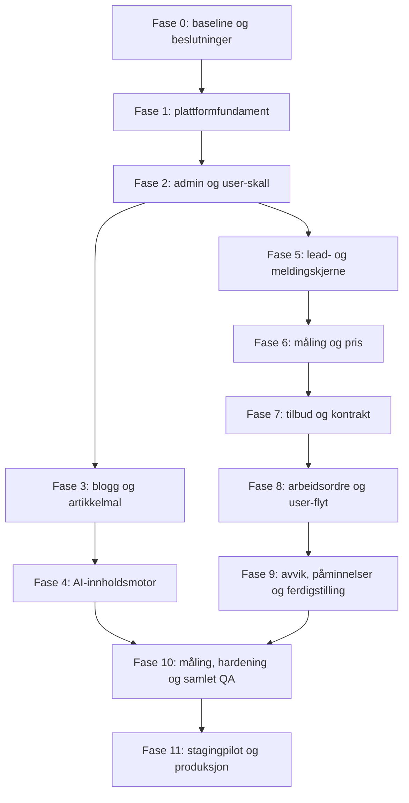

# Takfornyelse.as – samlet implementeringsplan

**Status:** Aktivt gjennomføringsgrunnlag  
**Opprettet:** 23. august 2026  
**System:** Eksisterende Next.js 15 + Payload CMS-applikasjon i `landing_no`  
**Produksjonsflater:** `takfornyelse.as`, `/admin`, `/user` og sikre kundelenker  
**Arbeidsregel:** Én fase ferdigstilles, testes og godkjennes før neste fase åpnes

## 1. Mandat

Dette er hovedplanen for å implementere den avtalte løsningen i én samlet plattform:

1. et forenklet administrasjonspanel på `/admin`;
2. en mobiltilpasset ansattportal på `/user`;
3. en AI-assistert SEO-blogg med to utkast per uke og menneskelig publiseringskontroll;
4. en komplett henvendelses-, måle-, tilbuds-, kontrakts- og ordreflyt;
5. kontrollert kundekommunikasjon før, under og etter oppdraget.

Planen skal brukes som operativ sjekkliste gjennom hele implementeringen. De tidligere roadmapene er fortsatt detaljerte spesifikasjoner, men ved konflikt bestemmer dette dokumentet rekkefølge, avhengigheter og leveranseporter.

## 2. Dokumenthierarki

| Nivå | Dokument | Formål |
|---|---|---|
| 1 | Dette dokumentet | Samlet rekkefølge, avhengigheter, kvalitetsporter og ferdigdefinisjon |
| 2 | [Admin- og brukerpanel](./takfornyelse-admin-user-panel-roadmap.md) | Detaljert UI, roller, arbeidsflyter, måling, tilbud og arbeid |
| 2 | [AI-assistert SEO-blogg](./seo-blog-automation-roadmap.md) | Temavalg, artikkelmodell, kvalitetskontroll, publisering og måling |
| 2 | `knowledge/FornyelseGruppen/02 Agent 24-7/Automatisk tilbud kontrakt og ordreplattform - roadmap.md` | Forretningsregler for tilbud, kontrakt, ordre, kommunikasjon og kontroll |
| 3 | Testplaner, migrasjoner og driftsnotater | Teknisk bevis for hver implementerte fase |

Nye varige beslutninger skal oppdateres både her og i den berørte detaljspesifikasjonen. Midlertidige utviklingsnotater skal ikke blandes inn i forretningsreglene.

## 3. Målbilde

```mermaid
flowchart LR
    A[Offentlig nettsted] --> B[Henvendelse]
    A --> C[SEO-artikkel]
    C --> B
    B --> D[AI-kvalifisering]
    D --> E[Admin-kontroll]
    E --> F[Takmåling og prisregelverk]
    F --> G[Godkjent tilbud]
    G --> H[Sikker kundelenke]
    H --> I[Signert kontrakt]
    I --> J[Arbeidsordre]
    J --> K[Ansatt på /user]
    K --> L[Kontroll før start]
    L --> M[Utført og dokumentert]
    M --> N[Ferdigmelding]

    O[AI-temaforslag] --> P[Bloggutkast]
    P --> Q[Admin QA]
    Q --> C
```



Alt skal ligge i samme Payload/Postgres-løsning. Det skal ikke bygges et separat kontrollsenter, en ekstra CRM-database eller en egen mobilapp i denne leveransen.

## 4. Fullført løsning – Definition of Done

Hele oppgaven er ferdig først når alle punktene under er dokumentert bestått:

- administrator kan drive blogg, henvendelser, tilbud, kontrakter, oppdrag og ansatte fra `/admin`;
- ansatte kan logge inn på `/user`, men bare lese og endre egne oppdrag;
- to relevante norske blogginnlegg kan opprettes som utkast per uke uten automatisk publisering;
- et blogginnlegg kan gjennomgås, forhåndsvises, planlegges, publiseres og måles;
- en kundehenvendelse mottas sikkert, vises i admin og får mottaksbekreftelse;
- AI kan oppsummere henvendelsen og lage svarutkast, men kan ikke sende tilbud på egen hånd;
- et egnet tak kan måles som kontrollert estimat med polygon, areal, vinkelgrunnlag, confidence og kilde;
- alle areal- og prisberegninger utføres deterministisk og kan reproduseres fra låste inputdata;
- administrator kan korrigere måling, velge prisregel og godkjenne tilbud;
- kunden kan lese, godta eller avslå tilbudet og signere riktig dokumentversjon fra telefon;
- signert kontrakt blir låst, sporbar og kan lastes ned;
- signert oppdrag kan tildeles en ansatt;
- den ansatte må gjennomføre før-kontroll før arbeidet kan startes;
- avvik over avtalt ramme blokkerer oppstart og krever skriftlig endringsgodkjenning;
- påminnelser og ferdigmelding sendes idempotent og leveringsfeil blir synlige i admin;
- tilgangskontroll, personvern, audit log, backup og gjenoppretting er testet;
- migrasjoner er prøvd mot en produksjonslik databasekopi;
- staging-piloten er godkjent før produksjonsaktivering;
- tekniske tester, lint, typecheck, build og definerte E2E-tester består.

En funksjon som bare virker lokalt uten tilgangskontroll, feilhåndtering, migrasjon, test og driftsbeskrivelse regnes ikke som ferdig.

## 5. Avgrensning

### 5.1 Inkludert

- eksisterende offentlige nettside og kontaktskjema;
- Payload som CMS og administrasjonsgrunnlag;
- roller `admin` og `worker`;
- bloggtemakø, AI-utkast, QA, planlegging og rapportering;
- leads, private bilder, AI-oppsummering og svarutkast;
- adresseoppslag, takpolygon, arealestimat og vinkelkorreksjon;
- versjonert prisbok og deterministisk prisberegning;
- tilbud, PDF, kontrakt, signaturbevis og endringsavtale;
- arbeidsordre, ansattflyt, før-/etterbilder og ferdigstilling;
- e-post og nødvendige påminnelser;
- adaptere for AI, kart, e-post, eventuell SMS og signering;
- sikkerhet, logging, overvåking, retention og testautomatisering.

### 5.2 Utsatt

- Google Ads- og Meta-styring i admin;
- regnskap, faktura, betaling, lønn og timeregistrering;
- avansert ruteoptimalisering;
- flere interne roller enn `admin` og `worker`;
- egen native mobilapp;
- generell kundekonto eller full kundeportal;
- automatisk publisering av blogg uten godkjenning;
- automatisk sending av pris, tilbud, kontrakt eller endringsavtale uten godkjenning;
- konstruksjons- eller HMS-avgjørelser tatt av AI;
- separat Laravel-/Filament-system eller ekstra CRM.

## 6. Nåværende teknisk grunnlag

Følgende skal gjenbrukes og beskyttes mot regresjon:

- Next.js 15, React 19 og TypeScript;
- Payload CMS 3 med PostgreSQL i produksjon og SQLite lokalt;
- eksisterende `/admin` og collections for `users`, `leads`, `posts`, `media` og nettstedinnhold;
- Payload drafts/versioning for blogg;
- Vercel Blob for media;
- eksisterende lead-API, bildeopplasting, rate limiting, honeypot/Turnstile, samtykke og UTM-attribusjon;
- Resend-adapter/fallback for lead-varsler;
- PDF-generering;
- Vitest, Playwright, ESLint og TypeScript-kontroll;
- eksisterende sitemap, robots, metadata, schema og flerspråklige ruter.

Før første kodeendring skal eksisterende tester og byggekommandoer kjøres og resultatet lagres som baseline.

## 7. Låste arkitekturprinsipper

### 7.1 Én applikasjon og én database

- Offentlig nettsted, Payload-admin, ansattportal og kundelenker bygges i samme Next.js-applikasjon.
- Payload/Postgres er system of record.
- Tunge og asynkrone operasjoner kjøres som sikre jobber, ikke i side-rendering.
- Nye collections opprettes bare når data har egen livssyklus, tilgang eller revisjonsbehov.

### 7.2 AI foreslår, regler bestemmer

AI kan klassifisere, oppsummere, foreslå tekst, polygon og vinkelgruppe. AI kan ikke være autoritativ kilde for pris, arealregning, mva, toleranse, maksimalbeløp, dokumentversjon, tilgang, sikkerhet eller HMS.

Alle tall beregnes i versjonert kode fra lagrede inputverdier. AI-tekst valideres mot disse verdiene før den vises eller sendes.

### 7.3 Menneskelig kontroll ved økonomisk eller offentlig effekt

Følgende krever eksplisitt administratorhandling:

- publisere et blogginnlegg;
- sende et personlig oppfølgingssvar med nye påstander;
- sende et tilbud, en kontrakt eller en endringsavtale;
- godkjenne lav-confidence-måling;
- godkjenne pris eller omfang over avtalt ramme.

### 7.4 Adaptere for eksterne tjenester

For å unngå leverandørlås bygges interne grensesnitt for:

- `AiProvider` – Gemini i produksjon, deterministisk fake i tester;
- `EmailProvider` – Resend i produksjon, log/outbox lokalt;
- `SmsProvider` – valgfri leverandør senere, deaktivert fallback nå;
- `MapProvider` – Kartverket-adresse og godkjent kart-/ortofotokilde;
- `SignatureProvider` – intern eller ekstern implementasjon bak samme kontrakt;
- `SearchDataProvider` – Search Console, Ads/CSV, Trends/CSV og lead-signaler.

Manglende API-nøkkel skal gi synlig `configuration_required`, ikke datatap eller skjult feil.

### 7.5 Feature flags

Risikofunksjoner aktiveres separat:

- `FEATURE_AI_DRAFTS`;
- `FEATURE_ROOF_MEASUREMENT`;
- `FEATURE_CUSTOMER_QUOTES`;
- `FEATURE_CONTRACT_SIGNING`;
- `FEATURE_WORKER_PORTAL`;
- `FEATURE_AUTOMATED_REMINDERS`;
- `FEATURE_SEO_SCHEDULER`.

Kode kan deployes avslått og aktiveres etter migrasjon, konfigurasjon og godkjent smoke-test.

## 8. Minste samlede datamodell

| Collection | Ansvar |
|---|---|
| `users` | `admin` og `worker`, aktiv/deaktivert, ansattprofil |
| `leads` | Kundehenvendelse, samtykke, kilde, kontakt, adresse, bilder, status og neste handling |
| `messages` | Utkast, godkjenning, kanal, mottaker, idempotency, levering og feil |
| `roof-measurements` | Adressekilde, koordinat, polygon, areal, vinkel, faktor, confidence og målebilde |
| `price-rules` | Versjonert prisbok, mva, minimum, toleranse, maksimalbeløpsregel og gyldighet |
| `quotes` | Låst beregningssnapshot, linjer, versjon, status og admin-godkjenning |
| `contracts` | Dokumentversjon, hash, vilkår, signaturstatus og bevis |
| `work-orders` | Tildeling, tidspunkt, status, kontroll, avvik, HMS og dokumentasjon |
| `posts` | Blogginnhold, utkast, språk, QA, forfatter, reviewer og måledata |
| `seo-topics` | Kandidater, kilde, score, overlapp, intensjon og status |
| `seo-runs` | Kjøring, prompt-/modellversjon, resultater, feil og opprettede utkast |
| `audit-events` | Kritiske endringer, aktør, tidspunkt, før/etter og korrelasjons-ID |
| `media` | Offentlig bloggmedia og private kunde-/arbeidsfiler med riktig tilgang |
| `site-settings` | Godkjente bedriftsfakta og ufarlige visningsinnstillinger |

Prisregler, kontraktsmaler og operative innstillinger må være versjonerte. Hemmeligheter skal aldri lagres i collections eller Git.

## 9. Kritiske tilstandsmaskiner

### 9.1 Henvendelse

```text
new → missing_information → preparing_quote → awaiting_admin
→ quote_sent → accepted | declined → contract_signed → work_created → closed
```

### 9.2 Blogg

```text
candidate → queued → draft → ai_qa → human_review
→ approved → scheduled → published → measured
```

### 9.3 Arbeidsordre

```text
assigned → on_the_way → arrived → precheck → area_confirmed
→ ready | blocked → started → completed → documentation_delivered → closed
```

Statusendringer skal valideres server-side. UI skal aldri kunne hoppe over en obligatorisk kontroll ved å kalle API-et direkte.

## 10. Tverrgående kvalitetskrav

### 10.1 Sikkerhet

- deny-by-default access-regler;
- objektfiltrering server-side for worker;
- private filer via autoriserte eller tidsbegrensede signerte URL-er;
- rate limiting på offentlige endepunkter;
- CSRF-/origin-kontroll der relevant;
- tokenhash i database, aldri rå kundetoken;
- utløp, tilbakekalling og engangsregler for sensitive lenker;
- audit event for pris, kontrakt, signering, tildeling og endringsavtale;
- ingen persondata eller hemmeligheter i AI-, jobb- eller feillogger.

### 10.2 Tilgjengelighet og mobil

- tastaturbetjening, synlig fokus, riktige labels og feilmeldinger;
- WCAG-kompatibel kontrast;
- `/user`, tilbud og signering testes først på mobilbredde;
- signering og opplasting skal fungere med berøring;
- kritisk informasjon skal ikke avhenge bare av farge.

### 10.3 Drift

- idempotency på cron, meldinger, dokumenter og statusoverganger;
- retry med grense og dead-letter/attention-kø;
- korrelasjons-ID gjennom lead, AI-kjøring, måling, tilbud og utsending;
- synlig helsestatus for integrasjoner;
- backup og dokumentert gjenoppretting;
- feature flags og tilbakeføringsplan per produksjonsfase.

### 10.4 Testpyramide

- enhetstester for regler, tilstander, tokens og beregninger;
- integrasjonstester for Payload access, hooks, jobber og adaptere;
- API-tester for validering, idempotency og negative tilgangstilfeller;
- Playwright for admin-smoke, worker, kunde og blogg;
- migrasjonstest på produksjonslik databasekopi;
- manuell QA for e-post, PDF, kart, signatur, mobil og tilgjengelighet.

## 11. Implementeringsrekkefølge



Fase 3–4 og fase 5 kan teknisk arbeides parallelt etter fase 2, men i denne gjennomføringen fullføres og verifiseres én fase om gangen for å redusere feil og migrasjonskonflikter.

## 12. Fase 0 – baseline og beslutningslås

**Mål:** Starte med dokumentert nåtilstand og ingen skjulte forretningsvalg.

### Leveranser

- kartlegg eksisterende routes, collections, access-regler, migrasjoner, cron og miljøvariabler;
- kjør og lagre baseline for lint, typecheck, unit tests, E2E der mulig og produksjonsbuild;
- registrer eksisterende produksjonsdata som må migreres, spesielt brukere, leads og posts;
- opprett beslutningslogg for pris, mva, toleranse, makspris, tjenester og kontrakt;
- fastsett synlig bloggforfatter og faglig kontrollør;
- bekreft reelle tjenesteområder, inkludert Ålesund/Møre og Romsdal;
- velg e-post-, signerings- og eventuell SMS-løsning;
- avklar kart-/ortofotolisens og kreditering;
- avklar juridisk eier for kontrakt, angrerett, tidlig oppstart og personvern;
- opprett anonymiserte testscenarier for lav, middels og høy måle-confidence.

### Fornuftige standardvalg hvis ekstern beslutning mangler

- Resend brukes til e-post fordi løsningen allerede har støtte;
- SMS-adapter bygges, men SMS holdes deaktivert;
- Gemini brukes bak adapter, med fake provider i tester;
- Kartverkets offisielle API-er brukes; ingen scraping av Norgeskart;
- blogg og tilbud krever alltid admin-godkjenning;
- norsk er primærspråk, engelsk blogg er valgfri;
- samme-site signering kan implementeres teknisk, men produksjonsaktivering blokkeres til juridisk kontroll;
- toleranse lagres konfigurerbart og får ingen skjult hardkodet forretningsverdi.

### Gate 0

- baseline er grønn eller eksisterende avvik er eksplisitt dokumentert;
- alle produksjonsblokkerende beslutninger har eier og status;
- ingen credentials eller persondata er lagt i repositoriet;
- detaljroadmapene og denne planen er konsistente.

## 13. Fase 1 – plattformfundament

**Mål:** Bygge felles grunnmur før forretningsfunksjoner.

### Leveranser

- innfør typed miljøvalidering og feature flags;
- bygg provider-grensesnitt og lokale fake/log-drivere;
- etabler standardisert jobbmodell med status, retry, idempotency og feilårsak;
- opprett `audit-events` og felles audit-tjeneste;
- opprett sikker token-tjeneste med hash, utløp og tilbakekalling;
- opprett sentral state-transition-validator;
- opprett pengesummer i heltall minste valutaenhet og felles mva-funksjoner;
- etabler private/public media-policy og autorisert filservering;
- legg til request-/correlation-ID og strukturert logging;
- opprett testfabrikker og anonymiserte fixtures;
- opprett additive Payload-migrasjoner med rollback-/gjenopprettingsnotat.

### Tester

- miljø mangler → tydelig konfigurasjonsstatus;
- dobbelt jobb-kall → én logisk effekt;
- utløpt/tilbakekalt token → avvist;
- ulovlig statusovergang → avvist;
- private media uten tilgang → avvist;
- audit event skrives for kritisk testhandling.

### Gate 1

- felles fundament kan brukes uten ekte Gemini-, SMS- eller signeringskonto;
- migrasjoner går både på tom database og produksjonslik kopi;
- ingen offentlig regresjon i leadskjema eller blogg.

## 14. Fase 2 – kontoer, `/admin` og `/user`-skall

**Mål:** To sikre interne flater med enkel navigasjon.

### Leveranser

- standardiser `users.role` til `admin` og `worker`;
- migrer eller avklar eksisterende `editor`-brukere;
- implementer deaktivering og session-tilbakekalling;
- tilpass `/admin` til seks grupper: Oversikt, Henvendelser, Arbeid, Blogg, Ansatte og Innstillinger;
- bygg adminoversikt med tomme/virkelige køkomponenter;
- bygg innlogget, mobil-først `/user`-layout;
- opprett server-side objektpolicy som bare gir worker tilgang til egne work orders;
- legg til 403/404-håndtering uten å lekke at et annet objekt finnes;
- opprett adminhandling for å opprette/deaktivere ansatte.

### Tester og Gate 2

- admin kan nå alle nødvendige adminflater;
- worker avvises fra `/admin` og fra en annen workers objekt, også ved direkte API-kall;
- deaktivert bruker mister tilgang;
- mobil navigasjon og utlogging virker;
- ingen kommende collection lanseres uten eksplisitte access-regler.

## 15. Fase 3 – bloggfundament og offentlig artikkelmal

**Mål:** Gjøre CMS og nettsted klart for kontrollert norsk SEO-innhold før AI kobles på.

### Leveranser

- opprett `seo-topics` og `seo-runs`;
- utvid `posts` med søkeintensjon, nøkkelord, tjeneste/sted, kilder, author/reviewer, QA og scheduling;
- gjør norsk publiserbar uten obligatorisk engelsk kopi;
- generer hreflang bare for faktisk eksisterende språkversjon;
- erstatt begrenset brødtekstvisning med sikker rich text/Markdown-støtte;
- bygg artikkelpreview som ikke indekseres;
- vis forfatter, kontrollør, kontrollert dato og kilder;
- legg til relaterte tjenester/artikler og naturlig CTA;
- ferdigstill canonical, Open Graph, `BlogPosting`, breadcrumbs og sitemap;
- spor CTA-klikk og leadattribusjon fra artikkel.

### Tester og Gate 3

- norsk-only draft kan lagres og forhåndsvises;
- draft er ikke offentlig eller i sitemap;
- publisert artikkel har korrekt metadata, schema, lenker og sitemap;
- mobilmal har ingen kritisk layout shift eller kontrastfeil;
- en manuelt skrevet testartikkel går komplett fra draft til målt lead uten AI.

## 16. Fase 4 – AI-assistert innholdsmotor

**Mål:** Opprette relevante, sporbare utkast to ganger per uke uten massepublisering.

### Leveranser

- implementer Search Console, Ads/CSV, Trends/CSV, anonymiserte leadspørsmål og manuell fagplan som prioriterte kilder;
- implementer topic score, overlap score og kannibaliseringskontroll;
- bygg versjonert bloggprompt med godkjent bedriftskunnskap;
- krev strukturert AI-output med artikkel, metadata, FAQ, CTA, lenker, kilder og kontrollpunkter;
- implementer fag-, språk-, originalitets-, SEO- og konverteringsporter;
- lagre modell-, prompt- og kunnskapsversjon i `seo-runs`;
- opprett maks to idempotente utkast per uke;
- varsle admin om utkast eller feil;
- bygg adminhandlinger for avvis, regenerer, rediger, godkjenn, planlegg og publiser;
- bygg innholdsrapport med indeksering, synlighet, CTR og leads når datakilden finnes.

### Sikker fallback

- uten Search Console eller Trends API brukes godkjent CSV/manuell input;
- uten Gemini opprettes tema/brief, men ikke kunstig fritekst;
- ingen rå kundehenvendelse sendes til temageneratoren.

### Tester og Gate 4

- samme tema/uke kan ikke opprette duplikat;
- lav kvalitet eller høy overlapp blokkerer godkjenning;
- AI kan ikke oppfinne eller endre pris/garanti;
- scheduler kan kjøres på nytt uten dobbel publisering;
- publisering krever eksplisitt adminstatus og gyldig tidspunkt;
- minst to komplette testutkast går gjennom AI QA og menneskelig QA;
- ingen AI-rute kan publisere direkte.

## 17. Fase 5 – henvendelser, innboks og AI-svarutkast

**Mål:** Gjøre eksisterende leadflyt til en trygg, handlingsorientert arbeidskø.

### Leveranser

- utvid `leads` med avtalt status, neste handling, ansvarlig og frister;
- bevar dagens validering, fleksibel adresse, kontaktkrav, bilder, samtykke, rate limit og attribusjon;
- opprett `messages` med draft/approved/queued/sent/delivered/failed;
- send enkel mottaksbekreftelse uten AI-avhengighet;
- la Gemini lage strukturert oppsummering, mangelliste, risikoflagg og norsk svarutkast;
- minimer persondata før AI-kall;
- bygg adminvisning med kunde, kanal, bilder, kilde, tidslinje og neste handling;
- bygg `Godkjenn og send`, `Be om informasjon`, `Start måling` og `Lukk`;
- vis leveringsfeil og AI-feil under `Krever oppmerksomhet`;
- legg til outbox/idempotency slik at dobbeltklikk ikke sender dobbelt.

### Tester og Gate 5

- eksisterende offentlige leadtester består;
- ny lead overlever e-post- eller AI-feil;
- mottaksbekreftelse sendes én gang;
- AI-output valideres før lagring;
- prisbudskap kan ikke sendes uten admin;
- audit viser hvem som godkjente meldingen;
- en testlead går fra nettsted til admin, svarutkast og kontrollert utsending.

## 18. Fase 6 – adresse, takmåling og prisberegning

**Mål:** Opprette et kontrollert måle- og pristilbudsutkast fra egnet kundeinformasjon.

### Leveranser

- normaliser adresse via Kartverkets adresse-API;
- hent lovlig bygg-/kart-/ortofotogrunnlag med nødvendig kreditering;
- opprett `roof-measurements` og redigerbart polygon i admin;
- la AI foreslå bygg, polygon og vinkelgruppe med confidence og begrunnelse;
- beregn georeferert horisontalt areal i kode;
- beregn skrått areal med `1 / cos(vinkel)`;
- støtt vinkelintervall og flere takflater;
- lagre kilde, timestamp, polygonversjon og kartbilde;
- opprett versjonerte `price-rules` med tjeneste, enhetspris, mva, minimum, toleranse og maksregel;
- beregn prislinjer deterministisk og lagre komplett input/output-snapshot;
- generer tilbudstekst som bare forklarer ferdig beregnede tall;
- blokker utsending ved lav confidence, uavklart bygg, ukjent vinkel eller ikke-prisbar tjeneste.

### Obligatoriske formeltester

| Vinkel | Faktor | 100 m² blir |
|---:|---:|---:|
| 22° | 1,079 | 107,9 m² |
| 27° | 1,122 | 112,2 m² |
| 32° | 1,179 | 117,9 m² |
| 36° | 1,236 | 123,6 m² |
| 40° | 1,305 | 130,5 m² |
| 45° | 1,414 | 141,4 m² |

### Tester og Gate 6

- referanseverdier og avrunding består;
- ulike takflater beregnes separat og summeres én gang;
- mva og pengesummer har ingen flyttallsfeil;
- samme låste input gir samme resultat;
- adminendring av polygon/vinkel oppretter ny versjon og ny beregning;
- AI-tekst avvises hvis tall ikke matcher systemet;
- lav confidence kan ikke omgås via API;
- tre anonymiserte scenarier for høy, middels og lav confidence gir riktig handling;
- kartvilkår og prisregler er godkjent før produksjonsbruk.

## 19. Fase 7 – tilbud, kundelenke, kontrakt og signering

**Mål:** Kunden kan forstå og signere nøyaktig det administrator har godkjent.

### Leveranser

- opprett versjonerte `quotes` og `contracts`;
- lås måling, prisbok og beregningssnapshot ved tilbudsgodkjenning;
- bygg sikker `/tilbud/[token]` for visning, spørsmål, godta og avslå;
- vis kartgrunnlag, estimert areal, antakelser, enhetspris, mva, total, toleranse og makspris;
- generer tilgjengelig PDF fra samme datakilde som nettsiden;
- bygg kontrakt fra godkjent tilbudsversjon;
- implementer signaturflate for mus/penn/finger og eksplisitt samtykke;
- lagre dokumenthash, tidspunkt, versjon, signaturbevis og sikkerhetsmetadata;
- gjør signert dokument uforanderlig og send kunden kopi;
- implementer utløp, tilbakekalling og regenerering av kundelenke;
- implementer juridisk godkjent tekst for angrerett og eventuell tidlig oppstart.

### Tester og Gate 7

- token gir bare tilgang til riktig kundeforhold;
- utløpt eller tilbakekalt token avvises;
- godta/signere er idempotent;
- endring etter godkjenning lager ny versjon;
- signaturhash matcher nøyaktig dokument;
- pris inkl. mva er lik i admin, web, PDF og e-post;
- kunden kan fullføre hele flyten på mobil;
- kontraktstekst, signaturmetode og personvern er juridisk vurdert før produksjonsflagget aktiveres.

## 20. Fase 8 – arbeidsordre og ansattportal

**Mål:** Et signert oppdrag kan tildeles og utføres med obligatorisk kontroll.

### Leveranser

- opprett `work-orders` fra signert kontrakt;
- la admin tildele worker og dato;
- bygg `/user` med Mine oppdrag i dag, Kommende og Må ferdigstilles;
- bygg mobil oppdragskort med kontakt, navigasjon, tjeneste, bilder, areal, toleranse og makspris;
- implementer avtalt arbeidsstatusmaskin;
- krev før-bilder, taktype, målt areal/metode, vinkelgrunnlag, synlig tilstand og HMS/adkomst;
- beregn avvik mot låst kontrakt;
- vis tydelig `Klar til start` eller `Blokkert` med forklaring;
- blokker start ved makspris-, omfangs- eller HMS-avvik;
- krev etterbilder og dokumentasjon før ferdigstilling;
- synkroniser alle worker-hendelser til admin-tidslinjen.

### Tester og Gate 8

- bare tildelt worker kan se og endre ordren;
- statuser kan ikke hoppes over;
- manglende precheck blokkerer start;
- avvik innenfor kontrakt gir korrekt prisbekreftelse;
- avvik over ramme blokkerer start;
- manglende etterdokumentasjon blokkerer lukking;
- et komplett testoppdrag går fra signert kontrakt til ferdigdokumentasjon på mobil.

## 21. Fase 9 – endringsavtale, meldinger og ferdigstilling

**Mål:** Håndtere avvik og tidsbestemt kommunikasjon uten overraskelser eller dobbeltsending.

### Leveranser

- generer versjonert endringsavtale med før/etter-beløp og årsak;
- krev admin-godkjenning før endringsavtalen sendes;
- krev kundens skriftlige godkjenning før berørt arbeid starter;
- reduser pris automatisk ved lavere faktisk areal etter avtalt enhetspris;
- send målebekreftelse når avviket er innenfor eksisterende ramme;
- implementer planleggingsbekreftelse, 48-timerspåminnelse, eventuell samme-dag-beskjed og ferdigmelding;
- implementer kø, retry, leveringsstatus, stoppregel og attention-kø;
- respekter kanalpreferanser og saklig norsk tone;
- legg ved relevante ferdigdokumenter og etterbilder i ferdigmeldingen.

### Tester og Gate 9

- endring over maks kan ikke starte uten admin og kunde;
- planlagt jobb sender hver melding maksimalt én gang;
- kansellert/endres oppdrag avbryter gamle påminnelser;
- leverandørfeil gir retry og synlig oppgave;
- lavere areal reduserer pris korrekt;
- ferdigmelding sendes først når ordren er ferdig og dokumentert;
- hele kundereisen kan kjøres uten manuelle databaseendringer.

## 22. Fase 10 – samlet hardening, SEO-måling og operativ kontroll

**Mål:** Gjøre alle delsystemer produksjonsklare som én plattform.

### Leveranser

- bygg samlet adminoversikt for oppmerksomhetskøer, kommende arbeid, blogg og integrasjonsfeil;
- implementer Search Console- og leadmåling per artikkel;
- implementer innholdsaudit: oppdater, slå sammen, redirect eller behold;
- implementer integrasjonshelse uten å vise hemmeligheter;
- gjennomfør WCAG-, ytelses- og mobilgjennomgang;
- gjennomfør access-control- og tokenmisbrukstester;
- dokumenter backup, restore, retention, sletting og incident-prosess;
- oppdater personvernerklæring og databehandleroversikt;
- valider all norsk kundetekst og merkevarestemme;
- test migrasjon og rollback på anonymisert produksjonskopi;
- fjern døde feature paths og sikre at utsatte funksjoner ikke er synlige.

### Obligatorisk verifikasjon

```bash
npm run lint
npm run typecheck
npm run test
npm run build
npm run test:e2e
```

Manuell smoke kjøres på offentlig skjema, `/admin`, `/user`, tilbud/PDF/signering, test-e-post, bloggpreview/publisering/sitemap, attribusjon, private media og utløpte tokens.

### Gate 10

- ingen åpne kritiske eller høye sikkerhetsfeil;
- alle automatiske tester er grønne;
- manuell QA-sjekkliste er signert;
- drifts- og tilbakeføringsplan er ferdig.

## 23. Fase 11 – stagingpilot og kontrollert produksjonssetting

**Mål:** Aktivere løsningen gradvis med ekte kontroll, ikke som ett stort risikohopp.

### Trinn A – intern staging

- bruk fake/test providers der ekstern effekt ikke er ønsket;
- importer anonymiserte realistiske scenarier;
- kjør minst én full blogg-, lead-, tilbuds-, kontrakts- og arbeidsordreflyt;
- korriger alle blokkerende feil.

### Trinn B – begrenset ekte pilot

- aktiver én funksjonsgruppe om gangen;
- behold admin-godkjenning på alt offentlig og økonomisk;
- kjør 20–30 ekte henvendelser gjennom ny innboks;
- sammenlign AI-måling mot kontrollmålt areal;
- mål feil, behandlingstid, tilbudstid og kundespørsmål;
- kjør bloggpilot med opptil to utkast per uke;
- overvåk leveringsfeil, tilgang og integrasjonskostnad.

### Trinn C – produksjonsgodkjenning

- godkjenn confidence-, pris-, toleranse- og maksgrenser;
- godkjenn meldingsrytme, juridiske tekster og signeringsbevis;
- dokumenter go/no-go per feature flag;
- ta backup før aktivering;
- overvåk intensivt første driftsuke.

### Gate 11

- produksjonen er stabil uten tapte henvendelser eller uautorisert datatilgang;
- administrator kan håndtere feil uten direkte databaseinngrep;
- pilotresultat og gjenværende risiko er dokumentert;
- hele Definition of Done i kapittel 4 er oppfylt.

## 24. Faseavhengigheter og eksterne blokkere

| Behov | Blokkerer kode? | Blokkerer produksjon? | Fallback |
|---|---|---|---|
| Gemini API-nøkkel | Nei | AI-funksjoner | Fake provider og manuell tekst |
| Resend-nøkkel/domeneverifisering | Nei | Ekte e-post | Outbox/log-driver |
| SMS-leverandør | Nei | Bare SMS | E-post; SMS deaktivert |
| Search Console-tilgang | Nei | Full SEO-måling | CSV/manuell baseline |
| Trends API | Nei | Nei | Seed-liste/CSV/manuell kontroll |
| Kart-/ortofotolisens | Delvis | Automatisk måling | Admin legger inn måling manuelt |
| Signeringsvalg | Nei | Digital kontrakt | Testprovider; produksjonsflagget av |
| Juridisk godkjenning | Nei | Kontrakt/signering | Funksjon deployet avslått |
| Pris/toleranse/maksregel | Regelmotor kan bygges | Tilbud | Konfigurasjon mangler → blokkert |
| Ekte bloggforfatter/reviewer | Nei | Publisering | Draft-only |

Implementering kan dermed fortsette uten å gjette hemmeligheter eller forretningsverdier. En funksjon som mangler produksjonsgrunnlag skal være teknisk ferdig, testet og avslått med tydelig status.

## 25. Arbeidsprotokoll for implementeringen

For hver fase brukes samme arbeidsmåte:

1. les fasen og relevant detaljspesifikasjon;
2. inspiser eksisterende kode og urørte brukerendringer;
3. oppdater arbeidsplan med konkrete filer og tester;
4. implementer database og domeneregler først;
5. implementer API/access og deretter UI;
6. skriv negative tester samtidig med positiv flyt;
7. kjør fase-spesifikke tester;
8. kjør full regresjon før fasen lukkes;
9. oppdater dokumentasjon og miljøvariabeleksempel;
10. registrer åpne risikoer og produksjonsblokkere;
11. lukk fasens gate før neste fase starter.

Store endringer skal deles i små, reversible migrasjoner. Eksisterende urelaterte brukerendringer skal bevares. Produksjonsdeploy er en egen, eksplisitt handling etter Gate 10/11, ikke en automatisk konsekvens av at kode er skrevet.

## 26. Fremdriftslogg

| Fase | Status | Start | Ferdig | Bevis/PR | Åpne blokkere |
|---|---|---|---|---|---|
| 0. Baseline og beslutninger | Pågår | 2026-08-23 |  | [Backupmanifest](./pre-master-backup-2026-08-23.md) | Produksjonsdata-backup og forretningsbeslutninger |
| 1. Plattformfundament | Ikke startet |  |  |  |  |
| 2. Kontoer og panelskall | Ikke startet |  |  |  |  |
| 3. Bloggfundament | Ikke startet |  |  |  |  |
| 4. AI-innholdsmotor | Ikke startet |  |  |  |  |
| 5. Henvendelser og meldinger | Ikke startet |  |  |  |  |
| 6. Takmåling og pris | Ikke startet |  |  |  |  |
| 7. Tilbud og kontrakt | Ikke startet |  |  |  |  |
| 8. Arbeidsordre og `/user` | Ikke startet |  |  |  |  |
| 9. Avvik og kommunikasjon | Ikke startet |  |  |  |  |
| 10. Hardening og samlet QA | Ikke startet |  |  |  |  |
| 11. Pilot og produksjon | Ikke startet |  |  |  |  |

## 27. Første handling etter godkjenning

Start med fase 0, ikke med nye UI-skjermer:

1. kjør full teknisk baseline;
2. inventer nåværende Payload-modeller og produksjonsmigrasjoner;
3. opprett beslutningsregister med sikre standardvalg og eksplisitte produksjonsblokkere;
4. lag konkrete implementeringsoppgaver for fase 1;
5. først deretter begynn kodeendringer.

Denne rekkefølgen er den raskeste trygge veien til en komplett løsning fordi feil i roller, datamodell, prisversjoner eller audit ellers måtte bygges om i alle senere moduler.
