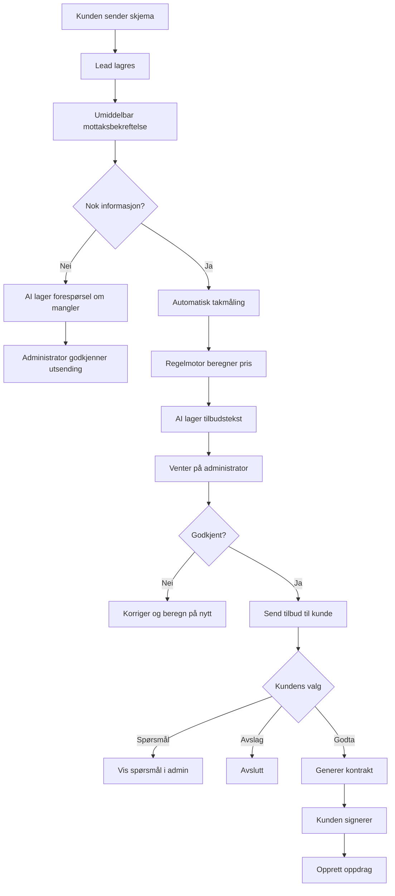

# Takfornyelse.as – forenklet admin- og brukerpanel

**Status:** Revidert etter stagingtest – detaljspesifikasjon for operativ portal
**Teknisk grunnlag:** Eksisterende Next.js 16 + Payload CMS 3-applikasjon
**Administrasjon:** custom portal på `https://takfornyelse.as/admin`
**Teknisk backoffice:** Payload på `https://takfornyelse.as/system-admin` etter cutover
**Ansattportal:** `https://takfornyelse.as/user`  
**Kontoer:** Kun `admin` og `worker`  
**Primærspråk:** Norsk bokmål

**Samlet gjennomføringsplan:** [Takfornyelse.as – samlet implementeringsplan](./full-platform-implementation-master-plan.md)

**Gjeldende faseplan:** [Operativ admin og automatisert kundereise](./custom-admin-and-automation-execution-plan.md). Ved konflikt gjelder denne nyere faseplanen.

## 1. Beslutning

Takfornyelse.as skal ikke kobles til et separat Laravel-/Filament-basert kontrollsenter. Den eksisterende applikasjonen, databasen, innloggingen og medielagringen gjenbrukes. Det bygges derimot en egen, forenklet operativ adminflate i samme Next.js-applikasjon. Payload beholdes som teknisk backoffice og fallback, ikke som administratorens normale arbeidsflate.

Løsningen skal ha to operative interne flater:

1. `/admin` – custom full administrasjon for én eller flere administratorer.
2. `/user` – enkel mobil arbeidsflate for ansatte som bare ser egne oppdrag.

I tillegg beholdes `/system-admin` som begrenset teknisk backoffice og fallback. Den regnes ikke som en daglig operativ flate.

Kundens tilbuds- og signeringslenke er en del av kundereisen, ikke en tredje intern administrasjonspanel.

```text
takfornyelse.as
├── /                         offentlig nettside
├── /admin                    custom operativ administrasjon
├── /system-admin             teknisk Payload-backoffice
├── /user                     ansattens egne oppdrag
├── /tilbud/[token]           kundens tilbud og signering
├── /ordre/[token]            enkel ordrestatus for kunden ved behov
└── /api                      interne API-ruter og automatisering
```

## 2. Mål for første versjon

Første versjon skal løse fire konkrete behov:

- administrere blogg og AI-genererte artikkelutkast;
- ta imot, svare på og følge opp kundehenvendelser;
- beregne et kontrollert foreløpig takareal og lage tilbud/kontrakt;
- tildele signerte oppdrag til ansatte og dokumentere utførelsen.

Løsningen skal redusere manuelt arbeid, men administrator skal godkjenne alt som kan binde pris, arbeidsomfang, kontrakt eller publisert innhold.

## 3. Dette finnes allerede

Eksisterende Takfornyelse.as har allerede:

- Payload-admin på `/admin`;
- autentiserte brukere med rollene `admin` og `editor`;
- `leads` for henvendelser;
- `posts` med utkast og versjonering for blogg;
- `media` og privat Vercel Blob-lagring;
- tjenester, produkter, prosjekter, FAQ, sider og nettstedinnstillinger;
- `POST /api/lead` med Zod-validering, rate limit og honeypot;
- lagring av UTM, Google-/Meta-klikk-ID og samtykkedata;
- e-post og PDF for nye henvendelser;
- norsk og engelsk offentlig nettsted.

Disse delene og datamodellene skal gjenbrukes. Den generiske Payload-brukerflaten erstattes ikke teknisk, men flyttes ut av den daglige arbeidsreisen.

## 4. Bevisst enkel arkitektur

```mermaid
flowchart LR
    A[Offentlig skjema] --> B[Eksisterende /api/lead]
    B --> C[(Samme Payload/Postgres-database)]
    C --> D[Custom /admin]
    C --> E[/user]
    C --> F[Kundens tilbudslenke]
    C --> K[Payload /system-admin]
    D --> G[Blogg, AI-utkast og publisering]
    D --> H[Henvendelse, måling, tilbud og kontrakt]
    D --> I[Oppdrag og ansatt]
    E --> J[Kontrollmåling og utførelse]
```

Det skal ikke bygges:

- en separat administrasjonsapplikasjon;
- en ekstra database;
- synkronisering mellom Payload og et annet CRM;
- separat innlogging for blogg og ordre;
- native iOS-/Android-app i første fase.

Under utvikling bygges custom admin på `/admin-v2`, mens Payload fortsatt ligger på `/admin`. Først etter godkjent samlet E2E byttes rutene kontrollert slik at custom admin blir `/admin` og Payload blir `/system-admin`.

## 5. Kontoer og tilgang

### 5.1 To kontotyper

| Konto | Tilgang |
|---|---|
| `admin` | Full tilgang til `/admin`, blogg, henvendelser, tilbud, kontrakter, oppdrag, ansatte og nødvendige innstillinger |
| `worker` | Kun `/user` og bare oppdrag som er tildelt den innloggede ansatte |

Eksisterende `editor` migreres til `admin` eller fjernes når den nye modellen tas i bruk.

### 5.2 Administrator

Administrator kan:

- opprette og deaktivere ansatte;
- se og behandle alle henvendelser;
- korrigere målinger og beregninger;
- godkjenne og sende tilbud;
- opprette og sende kontrakter/endringsavtaler;
- tildele oppdrag;
- se alle bilder og statuser;
- opprette, redigere, planlegge og publisere blogginnlegg;
- endre godkjente pris-, toleranse- og meldingsinnstillinger.

### 5.3 Ansatt

Ansatt kan:

- se egne tildelte oppdrag;
- åpne adresse og ringe kunden;
- registrere `på vei`, `ankommet`, `startet` og `fullført`;
- kontrollere og registrere faktisk takareal før oppstart;
- laste opp før-, underveis- og etterbilder;
- registrere avvik og foreslå tilleggsarbeid;
- ikke endre pris, kontrakt, blogg, andre ansatte eller andre kunders oppdrag.

### 5.4 Sikker innlogging

- Admin bør ha obligatorisk tofaktorautentisering før produksjon.
- Ansatte får egne kontoer, ikke delte passord.
- En deaktivert ansatt mister umiddelbart tilgang.
- Kundens tilbuds-/signeringslenke skal være tidsbegrenset og kunne tilbakekalles.
- En eventuell engangslenke til en midlertidig ansatt er ikke del av første MVP.

## 6. Forenklet custom `/admin`

Adminmenyen skal inneholde arbeidsområdene administratoren faktisk bruker:

```text
Oversikt
Henvendelser
Tilbud
Kontrakter
Arbeid
Dokumenter og faktura
Kundemeldinger
Blogg
Ansatte
Innstillinger
```

Dette er filtrerte arbeidsflater over samme saksdata, ikke nye separate CRM-systemer. Ingen egen meny for annonser, full regnskapsføring, avansert analyse eller andre virksomheter bygges i denne fasen.

### 6.1 Oversikt

Øverst vises handlingskøer og nøkkeltall:

- nye henvendelser;
- tilbud som venter på godkjenning;
- kontrakter som venter på signatur;
- aktive oppdrag;
- kundespørsmål som venter på svar;
- signerte avtaler uten selskapsaksept eller planlegging;
- dokument-/fakturautkast som mangler handling;
- mislykkede meldinger og automatiseringsjobber;
- blogginnlegg som venter på kontroll.

Under vises to handlingslister:

#### Krever oppmerksomhet

- ubesvart ny henvendelse;
- manglende kundeinformasjon;
- automatisk måling med lav eller middels sikkerhet;
- tilbud som venter på administrator;
- spørsmål fra kunde;
- areal/pris over avtalt grense;
- mislykket e-post, SMS eller AI-jobb.

#### Kommende arbeid

- dagens oppdrag;
- morgendagens oppdrag;
- signert oppdrag uten ansatt;
- oppdrag uten fullført dokumentasjon.

### 6.2 Samlet saksflate

Alle lister skal åpne én samlet kundesak. Administratoren skal ikke måtte kjenne navnene på Payload-collections eller åpne lead, måling, tilbud, kontrakt, arbeidsordre og melding i separate faner.

Saksflaten viser:

- kunde, adresse, samtykke, kontaktkanal og kampanjekilde;
- henvendelse, kundebilder og Gemini-oppsummering;
- adresseoppslag, byggkandidater, takpolygon, vinkelgrunnlag og confidence;
- deterministisk areal- og prisberegning med låst regelversjon;
- tilbud, PDF, kundestatus og spørsmål;
- kontrakt, kundesignatur, selskapsaksept og dokumenthash;
- tildeling, dato, workerstatus, før-/etterbilder og avvik;
- alle kundemeldinger, dokumenter, fakturastatus og audit-hendelser.

Øverst vises status, ansvarlig, frist og én tydelig primærhandling. Primærhandlingen følger saken, for eksempel `Be om informasjon`, `Kontroller måling`, `Godkjenn og send tilbud`, `Aksepter kontrakt`, `Tildel ansatt` eller `Kontroller ferdigdokumentasjon`.

### 6.3 Henvendelser

Listevisningen viser:

- navn;
- telefon;
- adresse/postnummer;
- tjeneste;
- status;
- mottatt tidspunkt;
- om automatisk måling finnes;
- om tilbud krever godkjenning;
- neste handling.

Henvendelsens detaljside samler:

- kundedata;
- adresse og eiendom;
- opprinnelig melding;
- bilder;
- annonsekilde der den allerede er registrert;
- manglende informasjon;
- AI-oppsummering og svarutkast;
- kartmåling og beregningsgrunnlag;
- tilbud og kontrakt;
- meldingshistorikk;
- tildelt oppdrag;
- enkel hendelseslogg.

Administratorens primærknapper:

- `Be om informasjon`;
- `Kjør automatisk måling`;
- `Kontroller beregning`;
- `Godkjenn og send tilbud`;
- `Send kontrakt`;
- `Tildel ansatt`;
- `Avslutt henvendelse`.

### 6.4 Tilbud

Tilbudskøen viser utkast, venter på kontroll, sendt, åpnet, spørsmål, akseptert, avslått og utløpt. Administrator åpner alltid den samlede saken, sammenligner måling, prislinjer og PDF og bruker én idempotent `Godkjenn og send`-handling. Ingen AI-tekst eller pris sendes uten denne kontrollen.

### 6.5 Kontrakter

Kontraktskøen skiller mellom kundesignering og endelig selskapsaksept. Etter kunden har signert, må en administrator akseptere eksakt dokumenthash på vegne av selskapet. Først da genereres endelig PDF, kunden får varig kopi og arbeidsordre kan opprettes. Juridisk godkjenning av tekst og bevismetode er produksjonsgate.

### 6.6 Dokumenter og faktura

Dokumentvisningen samler tilbud, kontrakt, endringsavtaler, målebekreftelse, ferdigrapport og fakturautkast/-referanse. Administrator skal se status og neste handling, men første versjon bygger ikke skyggebokføring. Offisiell fakturautsending krever godkjent nummerering, oppbevaring og regnskapsprosess eller valgt integrasjon.

### 6.7 Kundemeldinger

Meldingskøen viser utkast, planlagte, sendte, leverte, feilede og kundehenvendelser. Kunden får profilert norsk HTML-e-post med tekstfallback. Umiddelbare meldinger behandles hendelsesdrevet; daglig cron er bare sikkerhetsnett. Gemini kan foreslå svar, men administrator godkjenner alle tilbuds-, kontrakts- og avviksmeldinger.

### 6.8 Arbeid

Arbeid kan vises som enkel liste og enkel kalender.

Hvert oppdrag viser:

- kunde og adresse;
- avtalt tjeneste;
- estimert areal;
- enhetspris og maksimalbeløp;
- kontraktsstatus;
- tildelt ansatt;
- planlagt dato;
- kontrollmålt areal;
- avviksstatus;
- arbeidsstatus;
- før-/etterbilder.

Administrator kan:

- velge ansatt;
- velge eller flytte dato;
- se ansattens oppdateringer;
- kontrollere prisavvik;
- sende endringsavtale;
- sette oppdrag på pause;
- godkjenne ferdigdokumentasjon.

### 6.9 Blogg

Bloggmodulen bygger videre på eksisterende `posts`.

Visninger:

- foreslåtte temaer;
- AI-utkast;
- venter på godkjenning;
- planlagt;
- publisert.

Et innlegg trenger i første versjon:

- norsk tittel;
- slug;
- ingress;
- brødtekst;
- hovedbilde;
- SEO-tittel;
- SEO-beskrivelse;
- kilder/interne notater;
- status;
- planlagt/publisert tidspunkt.

Engelsk versjon skal ikke blokkere norsk publisering i denne fasen. Den kan genereres eller legges til senere.

Bloggflyt:

```text
AI foreslår tema
→ AI lager utkast
→ administrator redigerer
→ forhåndsvisning
→ publiser nå eller planlegg
```

Ingen AI-artikkel publiseres uten administratorgodkjenning.

### 6.10 Ansatte

Ansattlisten skal være enkel:

- navn;
- telefon;
- e-post;
- aktiv/inaktiv;
- kommende tildelte oppdrag;
- åpne oppdrag.

Handlinger:

- opprett ansatt;
- nullstill tilgang;
- deaktiver ansatt;
- åpne ansattens oppdragsliste.

Det skal ikke bygges lønn, timeliste, kompetansematrise eller resultatmåling i første versjon.

### 6.11 Innstillinger

Kun nødvendige innstillinger:

- tjenester og enhetspriser;
- mva;
- minimumspris;
- toleranse og maksimalbeløpsregel;
- godkjente takvinkler/faktorer;
- tilbudsmal;
- kontraktsmal;
- endringsavtalemal;
- e-post-/SMS-maler;
- Gemini-nøkkel, modell og bruksgrense;
- normal arbeidstid og kontaktinformasjon.

## 7. Henvendelses- og tilbudsflyt



### 7.1 Enkle statuser

Henvendelser skal bruke få forståelige statuser:

```text
Ny
Mangler informasjon
Tilbud klargjøres
Venter på administrator
Tilbud sendt
Godtatt
Avslått
Kontrakt signert
Oppdrag opprettet
Avsluttet
```

Systemet endrer status automatisk når en gyldig handling skjer.

## 8. AI-assistert automatisk takmåling

### 8.1 Hva AI gjør

Når adressen er presis nok:

1. Normaliser adressen via Kartverkets adresse-API.
2. Finn koordinater og hent et godkjent kart-/ortofotoutsnitt.
3. Finn sannsynlige bygg ved koordinatet.
4. Foreslå riktig hovedbygg og takpolygon.
5. Vurder om kundens bilder gir grunnlag for takform og vinkelgruppe.
6. Oppgi confidence og årsak til usikkerhet.

### 8.2 Hva vanlig kode gjør

AI skal ikke regne areal eller pris i fritekst. Regelstyrt kode skal:

- beregne polygonareal fra georefererte koordinater;
- velge godkjent helningsfaktor;
- beregne arealintervall når vinkelen er usikker;
- beregne faktisk behandlingsareal;
- bruke riktig prisbokversjon;
- beregne mva, minimum, estimert total og maksimalbeløp;
- validere at tall i AI-teksten er identiske med systemverdiene.

### 8.3 Takvinkelformel

```text
helningsfaktor = 1 / cos(takvinkel)
faktisk takareal = horisontalt takareal × helningsfaktor
```

Referanseverdier fra det interne beregningsgrunnlaget:

| Takvinkel | Faktor | 100 m2 horisontalt blir |
|---:|---:|---:|
| 22° | 1,079 | 107,9 m2 |
| 27° | 1,122 | 112,2 m2 |
| 32° | 1,179 | 117,9 m2 |
| 36° | 1,236 | 123,6 m2 |
| 40° | 1,305 | 130,5 m2 |
| 45° | 1,414 | 141,4 m2 |

Regler:

- bruk eksakt formel når vinkelen er dokumentert;
- ikke bestem eksakt vinkel bare fra flyfoto ovenfra;
- bruk sidebilder, tegning, kjent vinkel eller vinkelintervall;
- beregn forskjellige takflater separat hvis de har ulik vinkel;
- rund først sluttarealet til 0,1 m2;
- ikke legg til takutstikk to ganger;
- ved lav confidence skal tilbudet ikke kunne sendes uten korrigering/befaring.

### 8.4 Resultat i admin

Automatisk måling får én status:

- `Automatisk måling klar`;
- `Må kontrolleres`;
- `Befaring eller mer informasjon`.

Administrator ser:

- kartbilde med valgt bygg;
- redigerbart takpolygon;
- horisontalt areal;
- vinkelgrunnlag og faktor;
- estimert faktisk areal eller intervall;
- måleusikkerhet;
- prislinjer og total inkl. mva;
- maksimalbeløp;
- generert tilbudstekst.

Tilbudet opprettes alltid som utkast i `Venter på administrator`.

## 9. Pris, toleranse og kontrakt

### 9.1 Første avtale

For standardiserte overflatearbeider skal tilbud/kontrakt vise:

- estimert takareal;
- kart- og vinkelgrunnlag;
- enhetspris inkl. mva;
- estimert totalpris inkl. mva;
- avtalt arealtoleranse;
- maksimalbeløp uten ny godkjenning;
- at lavere faktisk areal gir lavere pris;
- at arealet kontrollmåles før arbeid.

Pilotverdien kan være 10 prosent toleranse, men skal være konfigurerbar og juridisk godkjent før produksjon.

### 9.2 Etter kundens godkjenning

- Systemet genererer kontrakt fra godkjent tilbudsversjon.
- Kunden åpner en sikker lenke og signerer.
- Signert dokument låses og kan ikke redigeres.
- Signaturen knyttes til dokumentversjon, tidspunkt og sikkerhetsbevis.
- Administrator ser signaturstatus i henvendelsen.

### 9.3 Kontroll før oppstart

Ansatt registrerer faktisk areal før arbeid:

| Resultat | Handling |
|---|---|
| Lavere areal | Reduser pris automatisk og send målebekreftelse |
| Høyere, men innenfor toleranse og maks | Avregn etter avtalt enhetspris og send målebekreftelse |
| Over maksimalbeløp | Blokker oppstart, varsle admin og send endringsavtale |
| Endret arbeidsomfang/skjult skade | Blokker berørt arbeid og krev endringsavtale |
| HMS-risiko | Stopp hele oppdraget og varsle admin |

Ny signatur kreves normalt ikke innenfor allerede avtalt ramme. Ny skriftlig godkjenning kreves når maksimalbeløp eller arbeidsomfang endres.

## 10. Kundens tilbudslenke

Kunden får en enkel merkevaretilpasset side på `takfornyelse.as/tilbud/[token]`.

Kunden kan:

- se tilbudet;
- se kartbildet og beregningen;
- se tydelig totalsum inkl. mva;
- stille spørsmål;
- godta eller avslå;
- signere kontrakt;
- godkjenne en eventuell endringsavtale;
- laste ned tilbud og signert dokument.

Dette er ikke en kundekonto. Det er en sikker, tidsbegrenset lenke til ett kundeforhold.

## 11. Forenklet `/user`

### 11.1 Startside

Ansatt ser bare:

```text
Mine oppdrag i dag
Kommende oppdrag
Oppdrag som må ferdigstilles
```

### 11.2 Oppdragskort

Oppdragskortet viser:

- kunde;
- telefon;
- adresse og navigasjonsknapp;
- planlagt tidspunkt;
- tjeneste og arbeidsbeskrivelse;
- kundens relevante bilder;
- estimert areal;
- toleranse og maksimalbeløp;
- obligatorisk sjekkliste;
- statusknapper.

### 11.3 Arbeidsflyt

```text
Tildelt
→ På vei
→ Ankommet
→ Før-kontroll
→ Areal kontrollert
→ Klar til start / Blokkert
→ Startet
→ Fullført
→ Dokumentasjon levert
```

Før-kontrollen krever:

- før-bilder;
- bekreftet taktype;
- faktisk areal og målemetode;
- vinkelgruppe eller bekreftet grunnlag;
- synlig tilstand;
- adkomst/HMS-avvik;
- kommentar ved avvik.

Den ansatte kan ikke trykke `Startet` før systemet viser `Klar til start`.

### 11.4 Mobil og dårlig dekning

- `/user` bygges mobil-først.
- Den kan installeres som PWA fra nettleseren.
- Første MVP kan kreve nettilgang for pris- og kontraktskontroll.
- Senere kan bilder og status legges i en lokal, kryptert synkroniseringskø ved dårlig dekning.

## 12. Bloggautomatisering

Blogg-roadmapet i `docs/seo-blog-automation-roadmap.md` gjelder fortsatt, men administreres fra samme `/admin`.

Første automatisering:

1. Systemet oppretter to temaforslag per uke.
2. Administrator velger eller avviser tema.
3. AI oppretter norsk utkast med kilder og interne lenkeforslag.
4. Innlegget får status `draft`.
5. Administrator redigerer og forhåndsviser.
6. Administrator publiserer eller planlegger.

Det skal ikke være automatisk publisering uten godkjenning i pilotfasen.

## 13. Minste nødvendige datamodell

For å unngå unødvendig CRM-kompleksitet brukes eksisterende `leads` som inngang og kundekort i første versjon.

Nødvendige Payload-collections:

| Collection | Bruk |
|---|---|
| `users` | Administratorer og ansatte (`admin`, `worker`) |
| `leads` | Kunde, adresse, behov, bilder og inngangsstatus |
| `roof-measurements` | Polygon, areal, vinkel, faktor, confidence og målebilde |
| `price-rules` | Enhetspriser, minimum, mva, toleranse og versjon |
| `quotes` | Tilbudsversjon, prislinjer, makspris og status |
| `contracts` | Kontraktsversjon, dokumenthash og signaturstatus |
| `work-orders` | Dato, ansatt, arbeidsstatus, kontroll og bilder |
| `messages` | Utsendelse, kanal, mal og leveringsstatus |
| `documents` eller tilsvarende samlet read-model | Tilbud, kontrakt, endring, ferdigrapport og fakturareferanse/status |
| `posts` | Eksisterende blogginnlegg og AI-utkast |
| `media` | Eksisterende bilder og dokumenter |

Tilleggsdata skal i første versjon ligge som felter/relasjoner på disse collectionene, ikke som mange små moduler.

## 14. Nødvendige ruter

Eksisterende ruter beholdes og utvides:

| Rute | Formål |
|---|---|
| `POST /api/lead` | Motta henvendelse |
| `/admin-v2` | Custom operativ admin under stagingutvikling |
| `/admin` | Custom operativ admin etter godkjent cutover |
| `/system-admin` | Begrenset teknisk Payload-backoffice etter cutover |
| `/user` | Ansattens oppdragsliste |
| `/user/arbeid/[id]` | Ansattens oppdragskort |
| `/tilbud/[token]` | Kundens tilbud, spørsmål og signering |
| `/ordre/[token]` | Valgfri enkel kundestatus |

Interne API-ruter skal dekke:

- kjøring av AI-kvalifisering;
- kart-/takmåling;
- prisberegning;
- godkjenning og utsending;
- kontraktsgenerering og signering;
- arbeidstakerstatus og bilder;
- endringsavtale;
- bloggtemaforslag og utkast.

Kritiske handlinger skal kreve autentisering, autorisasjon og idempotency-key der dobbeltkjøring kan gi skade.

## 15. Automatisk kommunikasjon i første versjon

Kun nødvendig kundekommunikasjon:

| Hendelse | Automatikk |
|---|---|
| Henvendelse mottatt | Umiddelbar bekreftelse |
| Informasjon mangler | AI-utkast, administrator godkjenner |
| Tilbud godkjent | Send tilbudslenke |
| Kontrakt signert | Send signert kopi og neste steg |
| Oppdrag planlagt | Send dato og praktisk informasjon |
| 48 timer før | Påminnelse |
| Samme dag | Ankomstvindu ved behov |
| Avvik over grense | Send endringsavtale etter admin-godkjenning |
| Arbeid fullført | Ferdigmelding og dokumentasjon |

Avansert kampanjeoppfølging og markedsføringsautomatisering er utenfor denne fasen.

## 16. Gemini-regler

Gemini kan:

- klassifisere henvendelsen;
- finne manglende informasjon;
- lage norsk svarutkast;
- foreslå stogpolygon og vinkelgruppe med confidence;
- forklare ferdig beregnede tall;
- generere bloggtema og artikkelutkast.

Gemini kan ikke:

- bestemme eller endre pris;
- sende tilbud eller kontrakt uten administrator;
- publisere blogg uten administrator;
- love oppstart, garanti eller endelig resultat;
- godkjenne avvik;
- gjøre sikkerhets-/konstruksjonsvedtak;
- motta unødvendige navn, telefonnumre, e-postadresser eller full adresse i standardprompt.

Bruk en enkel adapter rundt Gemini slik at modell kan byttes senere uten å endre forretningslogikken. Legg inn daglig/månedlig bruksgrense og malfallback.

## 17. Sikkerhet og personvern

- Ikke lagre API-nøkler i Git.
- Hold lead- og arbeidsbilder private; vis dem via signerte, tidsbegrensede URL-er.
- Worker-tilgang skal filtreres server-side på innlogget `user.id`.
- En worker må ikke kunne hente et annet oppdrag ved å endre URL-ID.
- Signerte kontrakter skal være uforanderlige og versjonerte.
- Logg administratorgodkjenning, prisbokversjon, beregning og signatur.
- Ikke send persondata til gratis/ugyldig AI-oppsett.
- Oppdater personvernerklæring for AI, tilbud, signering og meldingsleverandører.
- Ha databehandleravtaler og slettestrategi før produksjon.
- Gjennomgå kontrakt, angrerett, tidlig oppstart, toleranse og endringsavtale juridisk.

## 18. Historisk implementeringsinndeling

Fase 0–8 under beskriver den opprinnelige tekniske oppbyggingen og beholdes som sporbarhet. Den er ikke gjeldende rekkefølge for resterende arbeid. Custom admin, rask automatisering, selskapsaksept, dokument-/fakturakø og cutover gjennomføres etter R0–R10 i [gjeldende faseplan](./custom-admin-and-automation-execution-plan.md).

### Fase 0 – lås MVP-reglene

**Mål:** Unngå at utviklingen endrer retning underveis.

Oppgaver:

- godkjenne de to kontotypene `admin` og `worker`;
- godkjenne adminmenyen og worker-flyten;
- velge hvilke tjenester som kan prises per m2;
- godkjenne pris, minimum, mva, toleranse og maksimalbeløp;
- godkjenne tilbuds-, kontrakts- og endringsmal;
- definere obligatoriske før-/etterbilder;
- velge Gemini-, e-post-, SMS- og signeringsoppsett.

Ferdig når:

- beslutningslisten er skriftlig godkjent;
- juridisk gjennomgang er planlagt/eid;
- ingen funksjoner utenfor MVP ligger i aktiv utviklingsplan.

### Fase 1 – kontoer og panelskall

**Mål:** To sikre flater på samme nettsted.

Oppgaver:

- endre brukerroller til `admin` og `worker`;
- migrere eksisterende editorbrukere;
- gi admin full nødvendig Payload-tilgang;
- bygge innlogget `/user`-layout;
- implementere server-side tilgang til egne oppdrag;
- tilpasse `/admin`-navigasjonen til seks enkle grupper;
- lage første adminoversikt med tomme/ekte køer.

Ferdig når:

- admin kan logge inn på `/admin`;
- worker kan logge inn på `/user`;
- worker får 403/404 på andres oppdrag og adminruter;
- deaktivering stopper tilgang umiddelbart.

### Fase 2 – blogg i samme admin

**Mål:** Administrator kan håndtere norsk blogg fra `/admin`.

Oppgaver:

- utvide `posts` med tema, kilder, internlenker, kvalitetsstatus og AI-metadata;
- gjøre norsk innhold publiserbart uten obligatorisk engelsk oversettelse;
- legge til forhåndsvisning;
- legge til planlagt publisering;
- bygge temaforslag og AI-utkast som eksplisitte adminhandlinger;
- følge SEO-roadmapets kvalitetskontroller.

Ferdig når:

- AI kan opprette et norsk `draft` uten å publisere;
- admin kan redigere, forhåndsvise, planlegge og publisere;
- publisert innlegg vises på nettstedet og i sitemap;
- ingen utkast er offentlig tilgjengelige.

### Fase 3 – henvendelser og AI-svarutkast

**Mål:** Nye leads blir synlige og får kontrollert oppfølging.

Oppgaver:

- utvide `leads` med forenklet status og neste handling;
- bevare eksisterende skjema, rate limit, bilder, samtykke og attribusjon;
- sende umiddelbar standardbekreftelse;
- la Gemini oppsummere lead og finne mangler;
- lage svarutkast i admin;
- legge til `Godkjenn og send`;
- logge melding og leveringsstatus;
- vise mislykkede jobber under `Krever oppmerksomhet`.

Ferdig når:

- ny skjemaforespørsel vises i admin;
- administrator ser kilde, bilder, mangler og AI-utkast;
- AI kan ikke sende nestegangs-/prisbudskap uten godkjenning;
- en leverandørfeil mister ikke henvendelsen.

### Fase 4 – automatisk takmåling og prisutkast

**Mål:** En egnet adresse blir automatisk til et kontrollert måle- og pristilbudsutkast.

Oppgaver:

- integrere Kartverkets adresse-API;
- avklare lisensiert kart-/ortofototilgang;
- hente utsnitt og byggkandidater;
- la AI foreslå riktig bygg og takpolygon;
- beregne georeferert horisontalt areal;
- klassifisere vinkelgruppe fra egnede bilder;
- implementere `1 / cos(vinkel)` og referansetester;
- støtte vinkelintervall og takflater med forskjellig vinkel;
- bygge redigerbart kartfelt i admin;
- versjonere `price-rules` og beregninger;
- opprette målebilde, prislinjer, maksimalbeløp og AI-tilbudstekst;
- legge resultatet i `Venter på administrator`.

Ferdig når:

- en tydelig enebolig kan måles automatisk som utkast;
- 100 m2 gir dokumenterte referansearealer for 22-45°;
- admin kan korrigere polygon/vinkel og få ny beregning;
- lav confidence blokkerer utsending;
- AI kan ikke endre tall fra regelmotoren.

### Fase 5 – tilbud, kundevisning og kontrakt

**Mål:** Kunden kan forstå, godta og signere et godkjent tilbud.

Oppgaver:

- bygge versjonerte `quotes`;
- lage mobil tilbudsside med sikker token;
- vise kart, forutsetninger, prislinjer, mva, toleranse og makspris;
- støtte spørsmål, godta og avslå;
- generere PDF;
- bygge `contracts` fra låst tilbudsversjon;
- integrere valgt signeringsmetode;
- lagre dokumenthash og signaturbevis;
- sende kunden en varig kopi;
- implementere juridisk godkjent angrerett/tidlig oppstart.

Ferdig når:

- ingen tilbud sendes uten adminhandling;
- kunden kan fullføre på telefon uten konto;
- signaturen peker på nøyaktig dokumentversjon;
- signert dokument kan ikke redigeres;
- totalsum inkl. mva er tydelig.

### Fase 6 – arbeid, ansatte og `/user`

**Mål:** Signert tilbud kan tildeles og utføres kontrollert.

Oppgaver:

- bygge `work-orders`;
- la admin opprette/deaktivere worker-kontoer;
- la admin tildele ansatt og dato;
- vise egne oppdrag på `/user`;
- bygge mobil oppdragsdetalj og statushandlinger;
- kreve før-kontroll, bilder og faktisk areal;
- beregne avvik mot kontrakt;
- vise grønn/blokkert beslutning;
- blokkere `Startet` ved makspris, omfangs- eller HMS-avvik;
- vise alle worker-hendelser i admin.

Ferdig når:

- admin kan tildele et signert oppdrag;
- bare valgt worker ser oppdraget;
- worker kan fullføre før-kontroll fra telefon;
- innenfor ramme kan arbeidet startes;
- over ramme kan arbeidet ikke startes.

### Fase 7 – endringsavtale og ferdigstilling

**Mål:** Pris-/omfangsavvik og ferdig arbeid dokumenteres uten overraskelser.

Oppgaver:

- generere endringsavtale med før/etter-sammenligning;
- kreve admin før utsending;
- kreve kundens skriftlige godkjenning før berørt arbeid;
- redusere pris automatisk ved lavere areal;
- sende målebekreftelse innenfor avtalt ramme;
- kreve etterbilder og ferdigstatus;
- sende ferdigmelding og dokumentkopi.

Ferdig når:

- pris over maks aldri kan passere uten kunde og admin;
- lavere areal reduserer avtalt avregning;
- admin ser full før/etter-dokumentasjon;
- oppdrag kan ikke lukkes med manglende obligatoriske felt.

### Fase 8 – nødvendige påminnelser, QA og pilot

**Mål:** Løsningen tåler ekte drift med menneskelig kontroll.

Oppgaver:

- sende planleggingsbekreftelse, 48-timersvarsel og ferdigmelding;
- implementere kø, retry og synlig feilstatus;
- teste backup, gjenoppretting og token-tilbakekalling;
- sikkerhetsteste worker-tilgang og kundetokens;
- kjøre 20-30 ekte henvendelser med full admin-kontroll;
- sammenligne AI-estimat med kontrollmålt areal;
- justere confidence, toleranse og meldinger;
- gjennomføre juridisk/personvernmessig produksjonskontroll.

Ferdig når:

- ingen henvendelser eller meldinger mistes ved midlertidig feil;
- ingen worker kan lese en annens oppdrag;
- ingen AI-utkast publiseres/sendes automatisk;
- alle prisendringer kan spores;
- pilotrapport gir eksplisitt go/no-go.

## 19. Testkrav

Minimum automatiske tester:

- `admin` får tilgang til adminfunksjoner;
- `worker` avvises fra `/admin` og andre worker-oppdrag;
- lead-rate-limit og honeypot virker fortsatt;
- AI-feil oppretter fallback/oppgave;
- takvinkelformelen består alle seks referanseverdier;
- prisberegning bruker låst prisbokversjon og korrekt mva;
- tilbud kan ikke sendes uten admin;
- kontrakt kan ikke signeres med utløpt/feil token;
- signatur låser riktig versjon;
- worker kan ikke starte blokkert arbeid;
- endring over maks krever admin og kunde;
- blogg-draft er privat;
- bare eksplisitt publisering gjør innlegg offentlig;
- sitemap oppdateres etter publisering.

I tillegg:

- mobil E2E for `/user`;
- mobil E2E for kundens tilbud og signering;
- admin-smoke for alle seks menygrupper;
- migrasjonstest mot en kopi av produksjonsdatabasen;
- manuell test av Norgeskart/Kartverket-kreditering og lisenskrav.

## 20. Bevisst utsatt til senere

Følgende er gode muligheter, men skal ikke implementeres før kjernefasene fungerer:

- Google Ads- og Meta-styring i admin;
- avansert markedsanalyse;
- offisiell regnskapsføring, betaling og automatisk fakturautsending; dokumentregister, fakturautkast/-referanse og status er inkludert;
- lønn, timer og medarbeiderprestasjon;
- ruteoptimalisering;
- flere interne roller enn admin/worker;
- flere merkevarer/nettsteder;
- fullverdig CRM-segmentering;
- native mobilapp;
- automatisk bloggpublisering;
- automatisk tilbuds-/kontraktsutsending uten admin;
- avansert AI-bildeanalyse av skade og HMS;
- separate kontrollsenter-servere eller databaser.

## 21. Åpne beslutninger før fase 0 lukkes

- Hvilke pakker/tjenester kan bruke arealbasert avtale?
- Hvilken starttoleranse godkjennes per tjeneste?
- Hvordan beregnes maksimalbeløpet?
- Hvilken metode bruker ansatte til kontrollmåling?
- Hvilken SMS-/signeringsleverandør velges?
- Hvem juridisk godkjenner kontrakt og endringsavtale?
- Hvilke før-/etterbilder er obligatoriske?
- Skal planlagt bloggproduksjon være nøyaktig to utkast per uke fra pilotstart?

## 22. Kilder og relaterte dokumenter

- `docs/seo-blog-automation-roadmap.md`
- `C:/Dev/takfornyelse-businesspress/knowledge/FornyelseGruppen/02 Agent 24-7/Automatisk tilbud kontrakt og ordreplattform - roadmap.md`
- `Slik beregnes takarealet.pdf`, mottatt 23. august 2026.
- `IMG-20260823-WA0008.jpg`, mottatt 23. august 2026.
- Kartverket adresse-API: https://www.kartverket.no/api-og-data/eiendomsdata/brukarrettleiing-adresse-api
- Kartverket bruksvilkår: https://www.kartverket.no/en/api-and-data/terms-of-use
- Håndverkertjenesteloven: https://lovdata.no/dokument/NL/lov/1989-06-16-63
- Angrerettloven: https://lovdata.no/dokument/NL/lov/2014-06-20-27
- Gemini API-vilkår: https://ai.google.dev/gemini-api/terms

Dette dokumentet er implementeringsgrunnlag, ikke juridisk rådgivning. Pris-, kontrakts-, angrerett-, signatur- og personvernflyt skal kvalitetssikres før produksjon.
